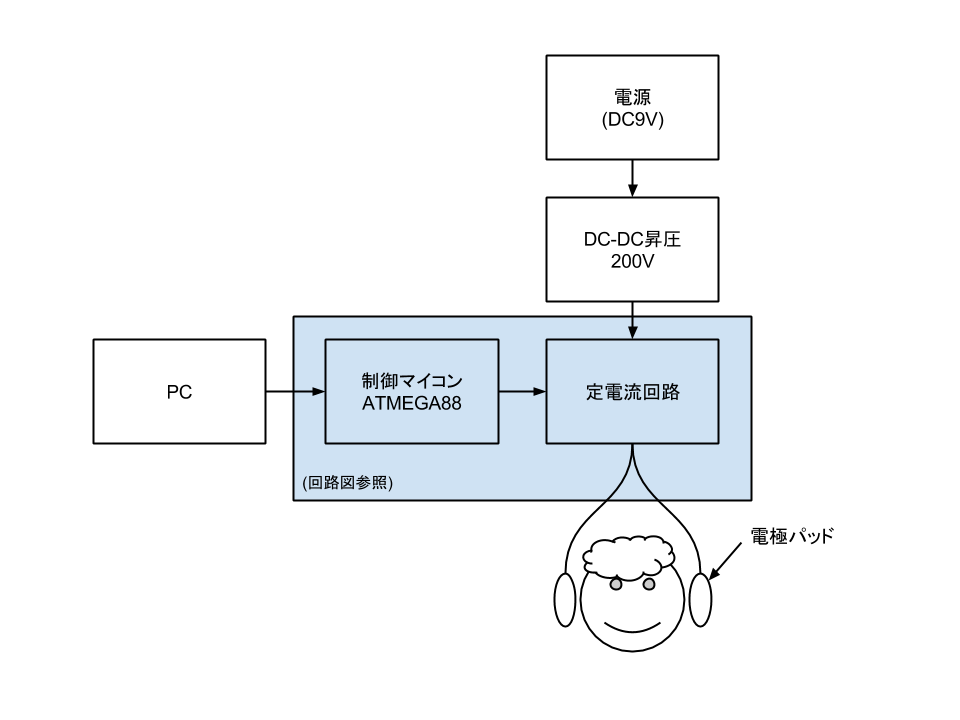
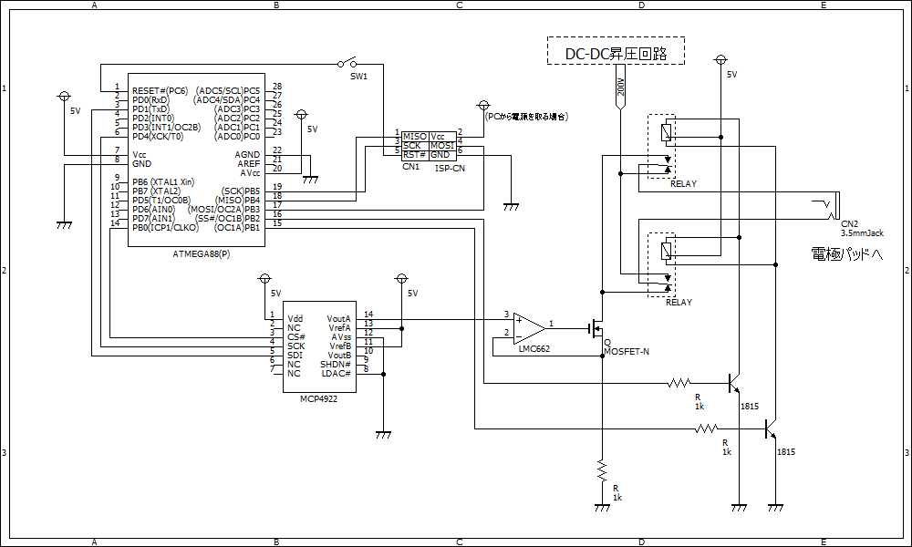
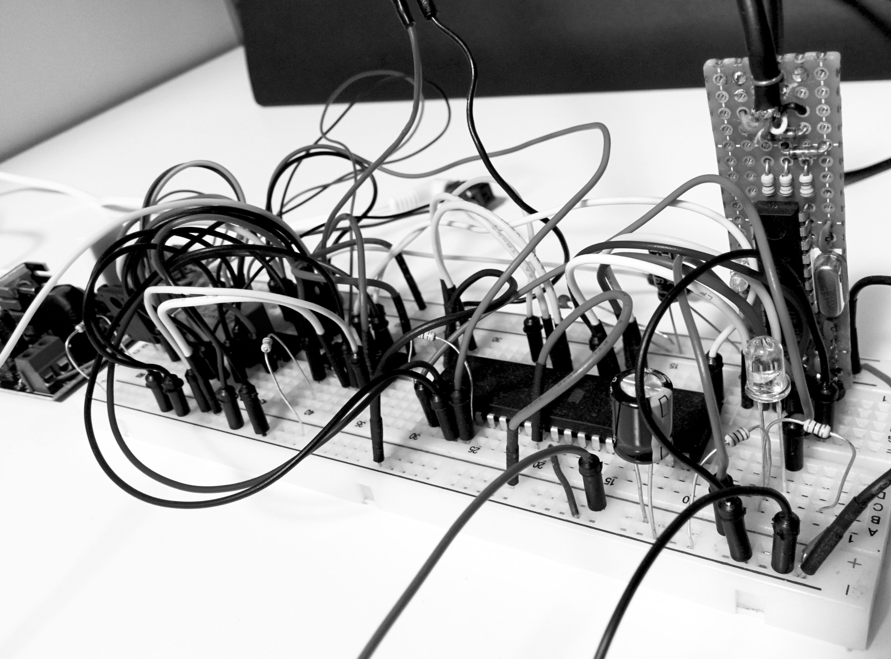
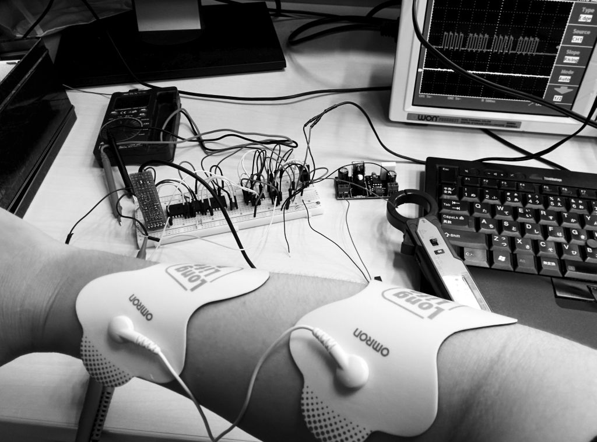
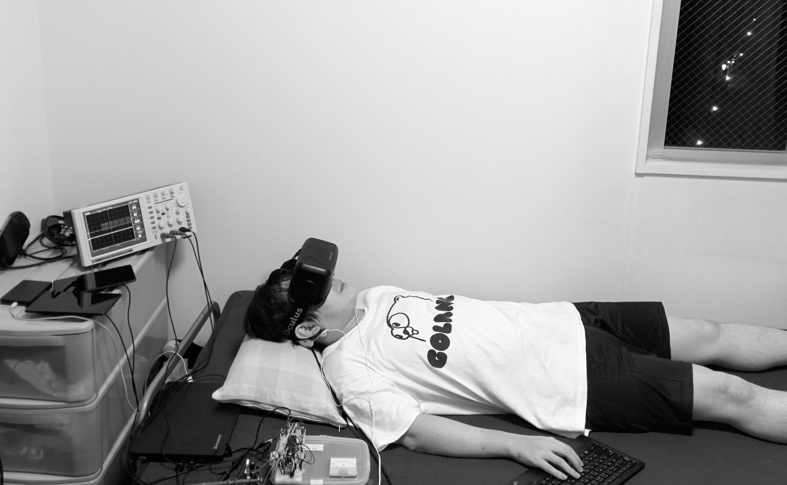

Title: オフトゥンでスヤァしながら加速度体験ができる秘密のデバイス
Subtitle: 電子工作＋バーチャル・リアリティ(仮)
Author: @binzume
Author(romaji): binzume

# オフトゥンでスヤァしながら加速度体験ができる秘密のデバイス

　こんにちは， binzume です．今回は頭に電流を流してバーチャルな加速度を感じて遊ぶ話を書きます．前庭電気刺激(GVS)とよばれる技術を用いて仮想空間上で擬似的な加速度を体感するための電子工作や簡単なアプリケーションを作成します．そこはかとなくマッドな雰囲気を感じる出だしですが，昔から研究されている現象でVR分野への応用もすでにされています．ちなみに，記事のタイトルはいつのまにか決められていました．オフトゥンでの利用は可能ですがスヤァできるかどうかは個人差がありますと断っておきます．

※ この記事を読んだ結果生じたいかなる損害に対しても責任は負えません．比較的危険は少ない内容ですが，電気の事故は生命に関わる場合もあるため，よく理解した上で遊びましょう．十分注意して自分の責任で行って下さい．

## 仮想世界と加速度


　[Oculus Rift](https://www.oculus.com/ "Oculus VR 社が開発したバーチャルリアリティ用のHMD")は大きな視野角を持っていることと，加速度センサやジャイロなどが内蔵されて装着者の頭の動きをトラッキングできるため，高い没入感が得られますが，仮想空間内で移動したりする場合はどうしても仮想空間内での風景の動きと，現実世界での身体の動きを一致させることは出来ず，違和感が生まれたり気持ち悪いと感じる事があります．

　気持ち悪さを改善する方法の一つとして，実際に身体を動かしてそれをポジショントラッキングで認識したり，外部から加速度や振動などを与える設備を用意することがあげられると思います．

　ポジショントラッキングについては，Oculus Rift DK2 からはカメラを使ったポジショントラッキング機能が追加され，現実世界での利用者の移動をVR空間へ反映させることが出来るようになりました．筆者も，[スマートフォンのセンサを使ったポジショントラッキング](http://qiita.com/binzume/items/3bbca6ab8a7926fc7255)をする実験などをするなどしてみて，部屋の中程度ならばある程度の精度で位置を推定できるのは確認できました．ただ，どちらの場合も移動できる範囲に成約があることと，自分の動きが反映されるため，可能な動作は制限されます．例えば車に載って時速100kmまで一気に加速する，とか高い場所から自由落下する，ような感覚を得るためには実際に同じ動きをする必要がありますが，よほど広くて起伏に富んだ部屋に住んでいない限り出来ません．外部から加速度や振動を与える装置も多く存在していますが，大掛かりになるため利用できるシーンはテーマパークなどに限られてしまいます．


　他にも，実際には加速したりしなくても，身体を動かすことでリアリティを向上することも多くの方が試みていて，[ニコニコ超会議2015でも様々な展示](http://www.ocufes.jp/2015/04/1220/)がされていて賑わっていました．自転車を実際に漕いだり，ブランコのような装置に乗ったりと，仮想空間内と近いシチュエーションを体験することで違和感なく高い没入感が得られます．

　どの手法も制約はありますが，実際のアプリケーションでは様々な工夫でカバーし，何よりも作るのも体験するのも楽しそうです．楽しそうなのですが，ただ，何かが違うという個人的な思いがあったので，理想型は何なのか考えなおしてみました．必要なのは 仮想空間内での運動 と 感じる加速度が同期することであって，実際に身体を動かす必要は無いはずです．一番理想に近いものはソードアート・オンラインに登場するナーヴギアで，マイクロ波で脳に直接信号を送って五感を再現できるという設定です．アニメの第１話でナーヴギアをかぶったキリトくんが部屋で一人ベッドに横になり「リンクスタート」する場面を見てください．

## 前庭電気刺激(GVS)

　2015年現在，ナーヴギアは残念ながら市販されていないため，代わりになるものを作る必要があります．同じことを考えている研究者は大勢いるはずで，少し調べるだけでも様々な記事や論文が見つかるはずです．ただ，素人でも簡単に作って試せる手法はあまりありません．そんな中，前庭電気刺激(GVS)という前庭に電流を流すだけで人間の平衡感覚を狂わせることができる技術があります．

　前庭電気刺激というと聞きなれない言葉かも知れませんが，古くから知られている現象で100年以上前から存在は知られています．前庭というのは，加速度を知覚し平衡感覚を司る前庭という組織で，内耳内の角速度を感じる三半規管に接する場所にあります．


　前庭に1～2mAの電流を流すと平衡感覚が狂い架空の加速度を感じます．電流の向きで加速度の方向はコントロールできることも知られています．頭に電流を流して感覚を操作するというと難しそうに感じるかもしれませんが，ただ電流を流してみることは簡単な回路で実現できるので作ってみることにします．

### 構成

　人体の抵抗値をテスターで測ってみると数十kΩあります．このうちの大半は皮膚の抵抗で，汗をかいているかどうかや皮膚の厚さによって大きく変動します．ここに数mAの電流を安定して流すすためには，100V以上の電圧で出力できる電流源が必要になります．必要なスペックの定電流装置が簡単には入手できなさそうなため，定電流回路を自作します．

　読者の中にはカメラのフラッシュの回路などで感電したことがある方も少なからずいるはずですが，そのとき火傷を負ってしまった人もいると思います．少ない電流でも，皮膚の一点に流し続けると火傷になってしまいます．これを避けるためには適度な範囲に均一に電流を流せる電極が必要になるので，どうしようか悩んだのですが，インターネットで調べてみて(注: http://www.todesking.com/hitosinigaderu/ )低周波治療器の電極パッドを使うことにしました．




### ハードウェア

　回路はなるべく簡単で安価なものにしたかったので，昇圧回路はキットを探しました．Aitendoで出力が126-311Vの調度良いDC-DC昇圧回路キットがあったのでこれを使うことにしました．

#### 回路図



　回路図は電源周りのコンデンサやスイッチなどは省略したものです．簡単に説明すると，DC-DC昇圧回路で昇圧した電源をMOSFETとオペアンプで制御しています．ここは教科書通りの典型的な定電流回路です．極性の切り替えは回路を単純にするためリレーで制御することにしました．リレーを使っているため極性の切り替えに数十msかかりますがほとんどの場合はこれで十分間に合います．回路図上ではリレーが２つありますが，昔買った詳細不明な2c接点ラッチングリレーがあったのでそれを使いました．

#### 主要パーツ

　主要なパーツです．抵抗・コンデンサ・トランジスタ等は省略しています．また，価格は参考用に書いていますが，購入時期によって異なる可能性があります．

<!-- 
| パーツ                 | 購入場所 | 価格(円) | 備考・URL                              |
| ---------------------- | -------- | -------- | -------------------------------------- |
| オムロン 電極パッド    | Amazon   |    1,345 | http://www.amazon.co.jp/dp/B0002ERMBE  |
| DC-DC昇圧回路          | aitendo  |      600 | http://www.aitendo.com/product/6872    |
| MOSFET 2SK3234         | 秋月     |      200 | 耐圧とゲート・ソース間電圧に注意       |
| OPアンプ LMC662CN      | 秋月     |      150 | フルスイング出力可能なもの             |
| D/Aコンバータ MCP4922  | 秋月     |      200 | SPIなのでマイコンと接続が楽です        |
| AVR ATMEGA88           | 秋月     |      170 | SPIで通信できるお好きなマイコンでOK    |
| 2c接点ラッチングリレー | 鈴商     |     不明 | 5Vで動作するもの                       |
-->

<table>
<tr>
<th>パーツ</th>
<th>購入場所</th>
<th>価格(円)</th>
<th>備考・URL</th>
</tr>
<tr>
<td>オムロン 電極パッド</td>
<td>Amazon</td>
<td>1,345</td>
<td>http://www.amazon.co.jp/dp/B0002ERMBE</td>
</tr>
<tr>
<td>DC-DC昇圧回路</td>
<td>aitendo</td>
<td>600</td>
<td>http://www.aitendo.com/product/6872</td>
</tr>
<tr>
<td>MOSFET 2SK3234</td>
<td>秋月</td>
<td>200</td>
<td>耐圧とゲート・ソース間電圧に注意</td>
</tr>
<tr>
<td>OPアンプ LMC662CN</td>
<td>秋月</td>
<td>150</td>
<td>フルスイング出力可能なもの</td>
</tr>
<tr>
<td>D/Aコンバータ MCP4922</td>
<td>秋月</td>
<td>200</td>
<td>SPIなのでマイコンと接続が楽です</td>
</tr>
<tr>
<td>AVR ATMEGA88</td>
<td>秋月</td>
<td>170</td>
<td>SPIで通信できるお好きなマイコンでOK</td>
</tr>
<tr>
<td>2c接点ラッチングリレー</td>
<td>鈴商</td>
<td>不明</td>
<td>5Vで動作するもの</td>
</tr>
</table>

　LMC662CNはたまたま手元にあったものなので，5Vで動いてフルスイング出力のものであればなんでも良いです．MOSFETはゲート電圧が5V以下でONになるものにしてください．LMC662もMCP4922も2chですが今回は１系統しか使用していません．



　動作確認用にブレッドボードに仮組みしてみました．だいぶひどい見た目ですがちゃんと動きます．写真ではATMEGA644が使われていますが，ATMEGA88で十分です．またPCからUSB経由で電源を取ることは可能ですが高電圧回路とグランドを共有しているのでご注意下さい．


### ソフトウェア

　AtmelのMEGA88でDACの制御や簡単な波形の生成を行いっています．MCP4922はSPI制御なので汎用性を考えなければマイコン等を使わないという手もありますが，単体で簡単な波形出力が出来たほうが動作確認が楽だったり，Bluetoothで接続したり出来るようにしたかったので，それなりに余裕を持ったスペックのマイコンを使っています．

　以下にAVRからMCP4922を使ってD/A変換する手順を載せておきます．

``` c
#define XCK_DDR   DDRD
#define XCK_BIT   4
#define DA_CS_PORT   PORTB
#define DA_CS_DDR    DDRB
#define DA_CS_BIT    0

void init() {
	DA_CS_DDR |= _BV(DA_CS_BIT); // MCP4922 CS#
	XCK_DDR |= _BV(XCK_BIT); // XCK
	UBRR0 = 0;
	UCSR0C = (1<<UMSEL01)|(1<<UMSEL00)|(0<<UCPHA0)|(0<<UCPOL0); // MSPI mode.
	UCSR0B = (1<<TXEN0); // Send only.
	UBRR0 = 1; // Bbaud rate
}
```

　まず，AVRのメインのSPIインターフェイスはプログラムの書き込みやPCとの通信に使いたいのでシリアルインターフェイスをMSPIモードで動作するように初期化します．

``` c
void send_byte(uint8_t a)
{
    while (bit_is_clear(UCSR0A, UDRE0)); // 送信可能になるまでまつ
    UDR0 = a;
}

void set_da(uint16_t v) {
    DA_CS_PORT &= ~_BV(DA_CS_BIT);
    send_byte(0b00110000 | ((v >> 8) & 0x0f ));
    send_byte(v);
    while (bit_is_clear(UCSR0A, TXC0)); // wait to complete.
    _delay_us(5);
    DA_CS_PORT |= _BV(DA_CS_BIT);
}
```

　`set_da()`関数でMCP4922コマンドを送り出力電圧をセットします．MCP4922の動作電圧が5Vなので，出力も0～5Vを4096段階で出力できます．回路図のオペアンプの下にある電流検出抵抗が1Ωなので，最大値の5Vに設定(`set_da(4095)`)すると約5mAの電流が流れます．作りたいプログラムは指定した波形をMCP4922を使って電圧として出力する単純なものなのでこれで事足ります．

　AVRにプログラムを書き込むプログラマをそのまま通信用に用いて，電流値を設定するコマンドラインツールも適当に書きました．とりあえずWindows用です．動作確認とデバッグ用に作ったものなので，実際に使うならシリアルインターフェイスにするかBluetooth接続できるようにする予定です．

　もしコードに興味があれば記事の最後にGitHubのリポジトリのURLを載せてあるので参照して下さい．

## 動作テスト

　実際に人体で試す前に回路が正しく動作していることを確認します．定電流回路になっているため，なにも繋がずに電源を入れると電極には最大電圧の約200Vがかかっている状態になっています．回路がオープンになっていることを検出する仕組みが欲しいところですが、ひとまず実害はありません．電流値を1mA程度に設定し，電極間に適当な抵抗をつないで電圧を測定します．たとえば，抵抗値を10kΩとします．

```
  10V / 10kΩ = 1mA
```

　中学校で習うオームの法則です．この計算によれば電極間には10Vかかっていれば正常なはずです．指定する電流を2mAにすれば倍の電圧になります．また，抵抗値を変えても電流が一定になるように電圧が追従します．文章だけ読んでいると電流計使った方が直接的でわかりやすいと思われるかもしれません．もちろん回路に電流計を挟んでもほぼ同じ結果になりますが，回路の途中に何かを挟むのは面倒ですし，電流計を外して元に戻すときに回路を間違ったりするので，計算で求められる箇所なら電圧を測る方が簡単です．

　回路は正しく動いているようですがいきなり頭に電流を流すのは少しばかり怖いので，電極パッドを腕に貼って実験します．先ほどなにも繋いでいない場合に200Vかかっていても実害は無いと書きましたが，その状態で電極に触ると一瞬大きめの電流が流れてビリッとしてしまうので，電極を貼ってから電流を増やすことを推奨します．



　個人差はあると思いますが1mAくらいまでは特に何も感じません．2mA程度のパルスを入れるとちょっとだけピリピリする感じがあり，もう少し電流を流すと腕の筋肉が意識に反して収縮します．正しく動いている場合は大丈夫そうです．しかし，慎重に作業していても試行錯誤しているうちに間違って大きな電流を流してしまうことは十分予想できます．注意深く作業していてもうっかり感電することはあります．たぶん大事なので２度書きました．

　ハードウェア上の最大電流を流した場合どうなるかは確認しておきたいので，手っ取り早く電圧を制御しているFETの足をショートさせてみます．このとき金属のピンセットなどでショートさせる場合は，ピンセットを持った手に電流が流れないように絶縁に気をつけて下さい．特に右腕に電極を貼って左手で作業している場合，左右の腕の間に電流が流れるのでなるべく避けましょう．

　実際にやってみると，電流で筋肉が収縮するのに加え思ったより強い衝撃に驚いたため，咄嗟に腕を大きく動かしてしまい，配線に引っ張られて試作中だった回路が飛んできました．びっくりしましたが腕には感電での火傷などもなく大丈夫そうです．

　というわけで安全かどうかは置いておいて，被害は許容範囲なので頭に電極をつないで前庭を刺激してみます．派手に感電した直後なので，恐怖心が残ってますが耳の後ろ辺りに電極を貼ります．まだ電流を流してないのにドキドキするので電流恐怖症になったかと思いましたがすぐ収まりました．最初は慎重に0.5mAくらいから徐々に電流を増やしていきます．1mAくらいまでは特になにも感じませんが，1.5mAくらいになると身体が傾いたように感じます．話には聞いていても自分で体験してみると「おおぅ」と感動します．適当な信号を入力すると，世界が傾いて感じたり，グラグラ揺れたり，面白いです．

　**味がします**

　どうしても気になる現象がありました．いわゆる電気の味がします．とりあえずということで矩形波を出力していたのですが，極性が切り替わるタイミングでピリピリとした感覚と口の中になんとみ言えない味が広がります．少し不安になったので，オシロスコープで出力される信号の矩形のエッジ部分を観察してみると電流が流れ過ぎています．なんとなく予想はしていましたが，どうやら口の中に電流が流れそれが味として感じられていたようです．あと，あとから気づきましたが，目をつぶっていると，視界が微かにチカチカ光ることにも気づきました．特に身体に異常はありませんが，健康に害がないことを祈ります．徐々に電流を増やした場合は気にならなかったので，矩形波をやめて滑らかに変化させると改善しました．

## アプリケーション

　Oculus Riftで仮想空間内のプレイヤーを操作するとそれに連動した加速度を感じられる簡単なゲームを作ろうと考えていましたが，この記事を書くまでに間に合いませんでした．
　とりあえずスマホの加速度センサの信号を記録して，それを再生できるアプリを書きました．スマホのカメラで動画を撮っておくことで映像と加速度情報を同時に再生できます．スマホのカメラの画角の問題で品質はいまいちですが，電極をつないだ状態で映像をOculus Riftで表示すれば「それっぽい感じ」を味わえます．



## 課題

　とりあえず動いたので遊んでみましたが，いくつか改善したい点があります．

#### 1軸のみしか扱えない

　電極パッドを貼る位置を工夫することで，左右だけでなく前後や上下の感覚も(多少ですが)得られると思います．ただし，この回路は非絶縁なので複数用意して多軸対応を行おうとすると，ペアとなる電極とは別の電極間で電柱が流れてしまい正しく動作しません．これは回路の設計の問題なので比較的簡単に解決はできますし，入力を無線化した上で絶縁型の電源を利用すればこのままの回路でもよいでしょう．

#### 大雑把な感覚しか与えられない

　傾いたり揺れたりという感覚は得られますが，かなり大雑把なものなので細かな動作まで反映させるのは難しそうなのと，常にかかっている重力加速度を打ち消すほどの大きな感覚も得られないので，例えば自由落下する感覚を再現することも現状のままでは不可能そうでした．また加速度は身体全体で感じるものなので，前庭だけごまかしても違和感はなくならないので，解決が難しい問題です．

#### 角速度もどうにかしたい

　三半規管の内部はリンパ液で満たされ，その動きで角速度を知覚しています．リンパ液は電解液なので，例えば電流流しつつ強めの磁場を与えれば三半規管内のリンパ液を動かせないかとかとか．フレミングの法則でお馴染みのローレンツ力です．妄想ですが．

## まとめ

- 舐めなくても電気の味がする
- あまり複雑なことできないが，可能性感じる
- SAOのナーヴギアは結構遠い

　前庭電気刺激での感覚の制御は制限が多いですが遊びとしてはとてもおもしろいと思います．何らかの形で神経を選択的に刺激できれば夢は広がるのですが，今のところ頭に電極を刺すとかしかないのかもしれません．将来非侵襲で実現する技術が出てくることに期待したいです．非侵襲であれば比較的気軽に色々出来ますし，研究や応用が進むだろうなと考えています．

　冒頭にも書きましたが，危険な遊びなので十分気をつけて，自分の責任で行って下さい．この記事を読んだ結果生じたいかなる損害に対しても責任は負えません．特に電気の事故は生命に関わる場合もあるため，よく理解した上で遊びましょう．

　回路図や実験に使ったソースコードは[GitHub上](https://github.com/binzume/gvs)に置いておきます．

### 参考資料

　大阪大の[前田研究室](http://www-hiel.ist.osaka-u.ac.jp/japanese/exp/gvs.html)の解説はGVSについて理解するのに役立ちました．また，todesking氏の[人体に電流を流すためのハードウェアを作る](http://www.todesking.com/hitosinigaderu/)記事は回路の作成にあたって参考にしています．低周波治療器用の電極使うのもここからパクりました．

