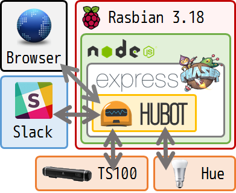
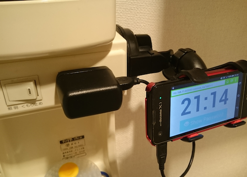
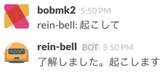
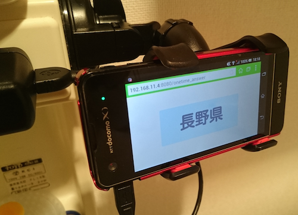
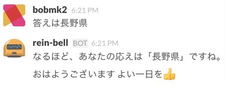
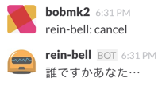

Title: 障害起きたら朝絶対起こされるマン
Subtitle:
Author: @Bob_Mk2
Author(romaji): Bob_Mk2

# 障害起きたら朝絶対起こされるマン

## はじめに
　こんにちは。ぼぶ(@Bob_Mk2)と申します。梅雨は開けましたがすっかり夏といった感じで寝苦しい日が続きますね。さて、今回は障害が起きた際に絶対起きられるようなシステムを自宅に構築したので、それに関して書きたいと思います。

## きっかけ
　現在在籍するチームで障害が発生した日に、部長と廊下で偶然すれ違った際に『bobくん、今日朝早かったでしょ？』「いえ、普通の時間(11:30)に出社しました」『え？障害あったのに？』「え」みたいなやりとりしたのがそもそものきっかけです。これまであまり障害が起きた際に緊急対応が必要なチームに属していなかったためかそこらへんの意識が低く、その時は他のチームメンバーに非常に申し訳ない気持ちになりました。
　また、基本的に自分は朝に弱く、Slackから何らかの通知があった際はスマートフォンがバイブする設定は有効になっていたのですが、障害の発生した当日はそのバイブに気づくことすらできず、自分は寝ていました。
　そのため、自分が朝起きられない現実を受け入れた上で、「よし、障害起きたら絶対起きるシステムを家に構築するぞ」と謎のモチベーションが生まれてシステム構築に踏み切りました。

## 目指すところ

　ゴールは、「障害が起きた際に自分がちゃんと起きられて、迅速に出社を可能にするシステムの構築」です。それを達成するための大まかな機能要件を以下のように定めました。

* 障害が起きたら手段を問わず自分を目覚めさせること
* 起動させる際は遠隔から操作可能なこと
* 停止させる際のプロセスが少し面倒くさいこと

　自分を目覚めさせる手段は、今回は、「音」と「光」に着目します。ベッドを起き上がらせるとか水を浴びせるなども考えられますが、設備や後片付けが大変なので今回は見送ります。この2つで本当に自分が起きられるのかは不安ですが。
　一方で、このシステムを起動する手段が限られていると起動するであろう他のメンバーが大変になるため、今回はSlack経由でシステムの起動を可能にします。Slackは社外システムであり、外部からもアクセス可能である利点を活かします。
　また、一般的な目覚まし時計のように停止させるプロセスが容易なものは二度寝の危険を招くため、停止するための手段を複雑にする必要があります。今回は、遠隔地(寝室より外)にワンタイムパスワードを表示して、それを確認しにいく手段を採用します。加えて、少しでも寝起き状態から覚醒状態にスムーズに移行できるように、ちょっとしたミニゲームをクリアしないとパスワードが表示されないようにします。

### システム利用時のフロー
システムを利用する際は以下のフローになると想定します。
1. 早朝に障害が発生
2. 検知した人(朝に強い人と想定)が、システムを起動
3. システムが起動し、寝ているであろう自分の寝室で大きな音と強い光が発生
4. 自分が目覚め、洗面台にある端末前に移動
5. 端末で自作のミニゲーム(雑なやつ)を遊んでクリア
6. 表示されるパスワードをシステムに入力し、音と光を停止
7. 着替えて出社

　2から6までの部分が今回作るシステムで補う箇所です。2から4までのフローで自分を目覚めさせ、5から6で二度寝を防ぎつつ出社への意識を高めます。
　システム起動は、今のところ他の方に頼る構成なので、将来的に異常を検知した社内システムから起動するようなフローも採用したいですね。誤検知で起こされたらたまったもんじゃないので、導入時は十分に検討しますが。

### システムの名前

「作るシステム」などと呼んでるとピンと来ないので、今回は上の機能要件を満たすものを「rein-bell」とそれっぽいかっこいい感じの名前を付けます。かっこいい名前は開発時のモチベーションの維持には重要です。

## rein-bellの構成

　rein-bellのざっくりとした構成は、以下のようになります。



　システムを乗せるサーバーは、今回は手持ちにあるRaspberry Pi 2 Model Bを利用します。さくらVPSなど借りてそこで動かすと、自室内で音や光を操作するために結局家の中にサーバーを置く必要性を感じたため、最初から全部ラズパイでやってしまおうという方針です。
　命令の受け口はNode.jsで動くHubotに頼ります。HubotがSlack上で命令を受け取りシステムの機能や停止を行います。また、Hubotはexpressを使っているため、ワンタイムパスワードを表示するページもHubotから発行させることができます。
　基本的にはHubotが受け口となり、音・光の操作や、ミニゲーム、パスワードページの発行を行います。

## rein-bellの実装

### 音の操作
　ラズパイ上で音を鳴らすことができるプレイヤーはいくつかありますが、開発や動作確認はMac上で行いたかったため、Macとラズパイの両方で動作し、nodeモジュールも存在する「mpg321」を採用しました。これ以外に何がいいものがあったら教えて下さい。
　HubotからBGMをリピート再生して、止める受け口を作るだけなら以下のように書けます。
```coffeescript
mpg321 = require('mpg321').remote()
playBgm = (file_name) ->
  player.play(file_name)
  player.on 'end', () ->
    player.play(file_name)
stopBgm = () ->
  player.stop()
```
　これで、システム起動時にBGMを鳴らし、停止時にそれを止める操作が可能になります。mpg321はディレクトリ内のランダム再生にも対応しているようでしたが、今回は決め打ちで固定BGMを鳴らすことに留めます。
　スピーカーは手元で余っていたタブレット用スピーカーのLogicool製 TS100を使います。TS100はスマートデバイスではないため、これは直接ラズパイのイヤホンジャックに繋いで操作します。

### 光の操作
　ランプは最近話題のHueを採用します。Hueはネットワーク経由でスイッチのON/OFFが切り替えられる点が非常に良く、また開発者向けのAPIが用意されているため操作する際に楽ができます。nodeモジュールは「node-hue-api」があるため、node上で操作する際はこのモジュールを使います。
　光を付けて、消すような操作は以下のように書けます。
```coffeescript
hue = require('node-hue-api')
HueApi = hue.HueApi
lightState = hue.lightState
rightOn = () ->
  api = new HueApi(HUE_HOST, HUE_USER)
  state = lightState.create().on().rgb(255,255,0).bri(255)
  api.setLightState(1, state).done()
rightOff = () ->
  api = new HueApi(HUE_HOST, HUE_USER)
  api.setLightState(1, lightState.create().off()).done()
```
前もって、`HUE_HOST`と`HUE_USER`は、自分で定めておきます。`HUE_HOST`はHueブリッジに割り当てられたIPアドレスです。node-hue-apiが自宅のLAN内にいるHueブリッジを見つけてくれる機能があるのでそれを利用すると手っ取り早いです。
```coffeescript
hue = require('node-hue-api')
hue.nupnpSearch().then (bridge) ->
    console.log('Hue Bridges Found:' + JSON.stringify(bridge))
  .done()
# => Hue Bridges Found:[{"id":"0123456abcd123abc","ipaddress":"192.168.11.11"}]
```
`HUE_USER`の設定は、今回の例だと、`http://192.168.11.11/debug/clip.html`をブラウザで開いてユーザ登録を行い、発行される`username`の値を利用します。詳しくはHue公式の[Getting started | Philips Hue API](http://www.developers.meethue.com/documentation/getting-started)のStep3を参照してください。

### ミニゲームの実装
　Javascriptで書けるゲームフレームワークであればenchant.js、jgame.jsなどいくつか候補に上がりますが、今回はせっかくなので、使ったことのないPhaserを採用します。こういう機会でも無いと中々触ることがないので良い機会と思って少しコストをかけて使ってみます。
　


　素材は同僚からいただいたドット絵を用いて作成しました。寿司を乗せた皿が上下に動いていて、タッチすると寿司を発射します。寿司を鹿にぶつけて全て倒したらクリアです。寿司を使いきっても鹿を倒しきれなかったり、人にぶつけたりすると最初からやり直しさせられます。クリアすると、ワンタイムパスワードページに遷移させます。
　画面から分かるように、複雑なゲームを作ったわけではないので、Phaserらしい機能を使ってる気がしませんでしたが、Groupの概念があり、Group同士の衝突判定を楽に書けるのが良かったです。例えば、寿司と鹿の衝突判定は以下のように書けます。
```javascript
function collisionCheck(){
  game.physics.arcade.overlap(sushis, sikas, collisionHandler, null, this);
}
function collisionHandler(sushi, sika){
  sushi.kill();
  sika.kill();
}
```

### パスワードの表示
　パスワードの表示には、手元で余っているAndroid端末を利用します。今回はXperia SX(SO-05D)が手元にあったため、これを利用します。
　表示するパスワードは数値やアルファベットなどが考えられます。一方で、状況が寝起きのためあまり複雑なものにすると、それを忘れるというリスクが考えられます。そのため、ここでは都道府県の名前を1つ表示することにします。ここで表示された都道府県名をSlackで発言することで、音や光を停止させます。

## 運用

### 機器の配置

今回利用する全ての機器は以下のようになります。
* Hue ×1
* Hueブリッジ ×1
* Raspberry Pi 2 Model B ×1
* スピーカー(Logicool TS100) ×1
* Xperia SX(SO-05D) ×1

#### ラズパイとHueとスピーカー
　これらは物理的に自分に近い位置にないと効果を発揮できないので、枕元の近くに配置します。配線の関係上ラズパイも近くに配置することになります。今はベッドの横にデスクトップPCがあるので今はそれらを全てPCの上に配置することにします。

#### Android端末
　パスワードを表示するためのAndroid端末は寝室よりも外に配置します。当初は玄関の扉に設置を考えていましたが、電源が確保できなかったため、洗面台に配置することにしました。
　ただ、Android端末をただ洗面台に配置しているのももったいないので、通常時は時計の機能を保有するようにしました。画面の焼き付きが気になりますが、代わりはいくらでもあるのであまり気にしないことにします。



### 実際に動かしてみる

　rein-bellの目覚ましを有効にする際は、Slack上に受け口があるため、キーワードに反応して目覚ましを有効にします。



　夜中に目覚ましを起動させたときのHueとその周辺機器を撮ってみました。ちょっと分かりづらいですが、だいぶ明るかったです。こんだけ明るくなればたぶん起きられるでしょう。後ろのスピーカーからは四魔貴族戦のBGMが大音量で流れています。


　その後、洗面台に向かい寿司と鹿のゲームをクリアし、パスワードを確認します。



　それを確認した後、PCかスマートフォンでSlack上でパスワードを告げます。rein-bellがそれを反応し、整合が取れた場合には音と光を止めます。パスワードは、ゲーム開始時に発行し寿命は3分なのでそれ以内にゲームクリアし答えを入力しないと再度洗面台に向かう羽目になります。



#### 起動できる人は絞る
　社内のSlack利用者全員からrein-bellの目覚まし機能を有効にできるようにしておくと、自分の部屋が色々リスクを抱えることになるので、rein-bellを使うことが出来る人をホワイトリストで管理し、それらをチームメンバーと関係者に絞ります。リストにない人が機能を使おうとしても弾きます。rein-bellは目覚ましのキャンセル機能は提供していますが、フローが破綻するので自分は利用できません。



#### 1日あたりのランニングコスト

　SANWAのワットモニターに今回利用する機器をすべてを繋げて、1日にかかる電気代を算出してみます。Hueとコンセントの接続は、ELPAのコード付ソケットを用い、1kWhの値段は東京電力の第1段階料金「19円43銭」と設定しました。測定してみた結果は以下のようになりました。基本的にアイドリング状態のほうが長いため、1月あたり約80円で運用できることが分かりました。
<table>
  <tr>
    <th>状態</th>
    <th>使用電力</th>
    <th>1日あたり</th>
    <th>30日あたり</th>
  <tr>
  <tr>
    <td>アイドリング</td>
    <td>4.0W〜6.0W</td>
    <td>2.7円</td>
    <td>81円</td>
  </tr>
  <tr>
  　<td>目覚まし稼働中</td>
  　<td>9.8W〜11.8W</td>
  　<td>4.6円</td>
  　<td>138円</td>
  </tr>
</table>


## おわりに
　今回は、障害が起きた時に絶対起こしてくれるシステム「rein-bell」 を構築しました。これを実装してから朝早く起こされる障害が起きていないのでいまいち効果が実感できてませんが、今後は障害が起きても誰かがきっとrein-bell経由で起こしてくれるので安心して毎晩床に付けます。それでは失礼します。
