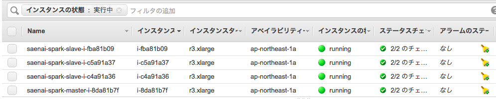
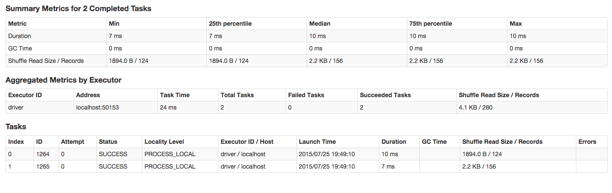
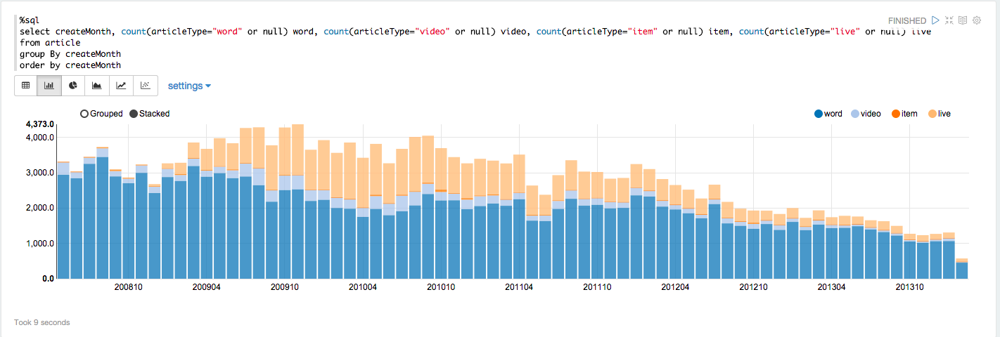

Title: 冴えないSparkの育て方
Subtitle: Spark入門からちょっとしたチューニングテクニックまで
Author: @jagaximo
Author(romaji): jagaximo

# 冴えないSparkの育て方

こんにちは！ @jagaximoといいます。

最近、[IBMが3500人をSpark関連に投入するというような感じの話題でちょっと盛り上がりを見せている](http://jp.techcrunch.com/2015/06/16/20150615ibm-pours-researchers-and-resources-into-apache-spark-project/)[Spark](http://spark.apache.org/)。

でもいざ調べて使ってみようとしても、何ができて、どういううれしみがあるかイマイチ分からない。みたいなことになるかもしれません。

そういう時、エンジニアであればやることはひとつだと思います。触ってみればいいじゃない。

ということで、この記事では、Sparkをどう始めればいいのか、そして冴えなくなった時にどうすればいいのかというのを簡単に紹介したいと思います(注:タイトルに関係あるのここだけです。)。

## Sparkって？

Apach Foundationのトップレベルプロダクトの一つで、Hadoopからの流れを汲む、分散処理基盤です。

大きなデータの塊を多数の小さなデータの塊に細かく分割して、それをクラスタの各マシンに渡し、クラスタはそれぞれデータを処理して、最後にマージする、というような手順を踏んで計算します。

この仕組がいわゆるMapReduceです。

HadoopもSparkもこのMapReduceの手順を踏んでタスクを処理する点では同じです。

ではSparkの何が嬉しいのか。Sparkのトップページにいくとこう書いてあります。

```text
Run programs up to 100x faster than Hadoop MapReduce in memory, or 10x faster on disk.
```

100倍早い。これはSparkがHadoopと違って一回のMapReduceタスクの結果を、それぞれのWorkerのメモリに乗っけるので、HDFSに保存する時のIOコストがかからないためです。

他にも、タスクの記述がHadoopよりも簡単、ビルトインのライブラリが優秀、DAGによる効率的な実行計画などが挙げられますが、ここでは割愛します。検索すれば割と簡単にヒットすると思います。

ここでは簡単にいろんな種類の分散処理がかける上に実行速度が早い分散処理基盤である、ということだけ覚えておけば良いと思います。

## Sparkセットアップ

Sparkはマシンクラスタを用意して計算させるのが本懐ですが、一つのマシンで動かす事もできます。まずそれで動かしてみましょう

### ダウンロード＆ビルド

いろんな方法がありますが、今回はソースをビルドして動かしてみます。

バージョンはこの記事を書いている時点の最新リリースである1.4.0を使用します。

また、この記事におけるSparkアプリケーションのコードはすべてこの1.4.0を基準に書かれています。

```bash
wget http://www.apache.org/dyn/closer.cgi/spark/spark-1.4.0/spark-1.4.0.tgz
cd spark-1.4.0
build/sbt -Pyarn -Phadoop-2.3 assembly
```

sbtでもmavenでも、ビルドは可能です。今回はsbtを利用しましたが、一回sbtビルドができなくなったまま放置されてた期間があるので、mavenビルドのほうが安全かもしれません。

巨大なScalaプロダクトなのでビルドには時間がかかります。ビルドしている間にイカでもプレイして遊んでいればいいと思います。

### データを用意する
Sparkは大きなデータを分析するための基盤です。ので、でっかいデータを食わせてみないと始まりません。
とはいえ本当に大きなデータを食べさせてもさすがに動かなかったり、時間がかかったりしてだるいので、小さなデータから始めましょう。

最初は、ニコニコデータセットのニコニコ大百科データのヘッダデータを使ってみたいと思います。

データの定義は、以下のようになっています。

```
カラム: 記事ID, 記事タイトル, 記事ヨミ, 記事種類(a:単語,v:動画,i:商品,l:生放送), 記事作成日時
※ユーザページ、ユーザIDは削除されています。
```

これがCSV形式で入っているようです。
データを落としてみると、年度ごとにCSVが分かれていてめんどくさかったのでマージしちゃいましょう。

```bash
cd path/to/data/dir
touch all.csv
ls -1 | grep head | xargs -I{} cat {} >> all.csv
```
データの中身を見ると

```csv
"1","ニコニコ大百科","ニコニコダイヒャッカ","a","20080512173939"
"4","カレー","カレー","a","20080512182423"
"9","ゴーゴーカレー","ゴーゴーカレー","a","20080512183606"
"311","もやしもん","モヤシモン","a","20080513184121"
"312","運営長","ウンエイチョウ","a","20080513185347"
"313","ニワンゴ","ニワンゴ","a","20080513185846"
"314","ニコニコ動画","ニコニコドウガ","a","20080513190203"
"73","新・豪血寺一族 -煩悩解放 - レッツゴー！陰陽師",\N,"v","20080513192636"
"316","支店を板に吊るしてギリギリ太るカレーセット","シテンヲイタニツルシテギリギリフトルカレーセット","a","20080513193502"
"317","アッー!","アッー","a","20080513194056"
```

みたいな内容が続いています。
`"` が非常にうざったいですが、ここでは処理せず、Sparkに読ませるときに処理しようと思います。

## ローカルで動作させる

### クエリを動かす
クエリはScala, Java, Python, Rでかけます。
今回、僕がScala好きなのでScalaで書いてます。

#### spark-shell
ひとまず動かすために、ビルドが終わったSparkのディレクトリへ行き `./bin/spark-shell` をすると、SparkのREPLが立ち上がると思います。
このREPLに対してクエリを打ち込むと使用できると思います。

#### RDD
SparkはRDDという型で処理したいデータを表現します。平たく言うと、ScalaのListみたいなものです。
このRDDに対してmapなどの処理を行う事で、データを操作して、欲しい情報に加工します。

mapというのは、Scalaやruby, haskellなどの言語に備わっているメソッドで、ここではリストなどのコレクションの全要素に対して、与えた関数の操作を行うものだと考えてください。

```scala
import org.apache.spark.rdd.RDD

// 1から1000までの数値が入ったRDDを作成する
val numbers: RDD[Int] = sc.parallelize((1 to 1000).toArray)

// 各要素が与えられ、それに対してどう操作するかを記述する。
// numberは、1, 2, 3...という数値が入っている。これら全てにtoStringを行うことでコレクションの中身をすべて文字列の1, 2, 3...に変換する
val strings: RDD[String] = numbers.map(number => number.toString)
```

これを読んでみるとわかると思いますが、mapの操作は、各要素を並列に計算しても問題がない内容ですね。

MapReduceのmap部分の元ネタになった操作はこれです。平行してできる計算はすべて平行して実行し、各要素が計算するのを待ち合わせてから集約(Reduce)するという操作を連続して行うことで大規模なデータをスケールアウトして計算できるわけです。
もちろん、mapだけではなく、Reduceに関する操作もあります。

また、map, reduce以外にも、それぞれの処理を行うメソッドはあります。

RDDでつかえるメソッドは[Hishidamaさんがまとめてくださっているページ](http://www.ne.jp/asahi/hishidama/home/tech/scala/spark/RDD.html)が神がかっていて素晴らしいです。

こちらを参考に、分からない事があったりしたらソースをあたったりしたら良いと思います。

試しに、ワードカウントのクエリを見てみましょう。
これは、一つの英文ドキュメントが与えられた時、その英文に含まれている各単語がいくつか数えるものです。
Spark公式ページにもあるWordCountをそのまま持ってきて、そこにコメントをつけたものです。

```scala
// テキストファイルを読む。hdfsから読んでいるが、ローカルから読むことも可能
// 型はRDD[String]になる。英文の1行が、RDDの1要素になっている
val textFile = spark.textFile("hdfs://...")

// textfileをスペース区切りでsplitして、RDDの1要素を1行から1単語に変換する
val counts = textFile.flatMap(line => line.split(" "))

                // 各要素を(単語、1)のタプルにする
                 .map(word => (word, 1))

                // 要素がタプルの場合、1番めの値をkeyとしてみて、それに対してreduceをかける
                // _ + _ は、key(単語)が同じだった場合、それぞれのvalueを足し合わせる
                // これで、keyごとに、右の値を足しあわせている。これで単語をkeyに、含まれる数をvalueにしたRDDができる
                 .reduceByKey(_ + _)

// カウントした数値を、そのままテキストファイルに保存する
counts.saveAsTextFile("hdfs://...")
```

イメージできたでしょうか？
Scalaプログラマからすれば、手に馴染んだコレクション操作で自由度の高い記述ができるのが魅力的かなと思います。

これをfor文とかに直して記述することは、残念ながらできません。その場合クラスタに処理が分割できないためです。

RDDに対する操作が、各クラスタに分割して計算できる内容になります。

#### DataFrame
SparkにはDataFrameという単位でデータを持つこともできます。
これはSparkのビルトインライブラリであるSparkSQLが提供しているモジュールです。

DataFrameは、その場で作るRDBMSみたいなものです。
RDDの中に入っているデータのカラムを設定し、SQLでクエリを発行することができます。

WordCountをDataFrameにして計算するのはあまりうれしみがないので、違う例を出してみます。
仮に次のようなCSV, `person.csv` を分析する時を考えます。

```csv
John Doe,28
Jane Doe,20
...
```

スキーマとしては `Name,Age` という形になるでしょうか。
このようなデータを分析したいなという時に、DataFrameは便利です。
公式サイトにある例を見てみましょう。

```scala
// SparkContextとSQLContextを作成する
// 今は気にしないでも大丈夫です。
val sc = new SparkContext("local")
val sqlContext = new org.apache.spark.sql.SQLContext(sc)
import sqlContext.implicits._

// case classでスキーマを表現する
case class Person(name: String, age: Int)

// CSVからDataFrameを作成する
val people = sc.textFile("examples/src/main/resources/people.txt").map(_.split(",")).map(p => Person(p(0), p(1).trim.toInt)).toDF()

// SQLを発行できるようにする。
people.registerTempTable("people")

// SQL文を発行する事ができる。
val teenagers = sqlContext.sql("SELECT name, age FROM people WHERE age >= 13 AND age <= 19")

// すべてのPersonのNameをとって標準出力するタスク
// フィールドをPersonクラスで定義した順序でとって来られる
teenagers.map(t => "Name: " + t(0)).collect().foreach(println)

// 上と同じタスク
// こちらはgetAsメソッドを使用してフィールド名で取得している
teenagers.map(t => "Name: " + t.getAs[String]("name")).collect().foreach(println)

// 上と同じタスク
// こちらは、中身をMapに変えている
teenagers.map(_.getValuesMap[Any](List("name", "age"))).collect().foreach(println)
// Map("name" -> "Justin", "age" -> 19)

```
このような感じで、case classのそれぞれの要素をスキーマとして登録してSQLを使い、その後mapなどの処理を通すことができます。
同じデータで様々な分析したいときなどにSQLで問い合わせできる素地作っておくと便利です。

また、SQLを解析する際に簡単な最適化を施してくれるなどの恩恵があるからか、RDDと比較して、安定して高速で動くらしいです。
DataFrameで処理できる場合は、DataFrame化して処理したほうが良さそうです。

RDDとDataFrameは、それについて記事一本かけるくらいに機能があります。
ここで紹介されている以外にもそれぞれのデータの精製方法、加工方法、出力方法などがあるので、気になる場合は公式ドキュメントやScaladoc, ソースなどに当たると良いと思います。

### 月ごとの記事数を、記事種類ごとにカウントする

#### データ整形
簡単なクエリを書いてみましょう。
ここでは、各月ごとにどの種類の記事がどれだけ書かれたかを算出するクエリを書いてみようと思います。
ちなみに `all.csv` のレコード数は203,822ですので、これだったら複雑なことしないのであればローカルマシンでも大丈夫なレコード数です。
まず、ヘッダデータを `Article` として、 `RDD[Article]` なarticlesを作成します。この後articlesを使用する場合はすべてここで定義したものを使用します。
Sparkに最も手早くクエリを動かそうと思った時は、

```scala
import scala.util.Try

val articleText = sc.textFile("file:///Users/jagaximo/data/head/all.csv")

// 記事ID, 記事タイトル, 記事ヨミ, 記事種類(a:単語,v:動画,i:商品,l:生放送), 記事作成月
case class Article(id: Int, title: String, articleType: String, createMonth: Int)

val articles = articleText.map(_.split(",")).map(a => Try{
    // 各文字列の""を取り除いている。
    val splits = a.map(_.init.tail.toString)
    Article(
        splits(0).toInt,
        splits(1),
        splits(3) match {
            case "a" => "word"
            case "v" => "video"
            case "i" => "item"
            case "l" => "live"
        },
        splits(4).take(6).toInt
    )
}).filter(_.isSuccess).map(_.get)
```

TryはScalaにおけるエラーを格納してくれる便利なクラスです。

ここでやっていることを簡単にいうとレコードを読み解いてArticleを生成し、Exceptionが発生したレコードに関しては読み飛ばしています。

この状態での全レコード数は 203,027 とそれなりに減ってしまいましたが、今回は集計を動かしてみることに集中したいので、このまま使っていきます。

#### RDDを使った集計

`articles` を使用して、最初の一歩として、月ごとの全記事数のカウントを行ってみましょう。

```scala
// articlesを作成月をキーにして格納する
articles.map(a => (a.createMonth, a))
        // 各キーごとの記事数をカウントする
        .countByKey
        // 出力する
        .foreach(println)
```

あんまり考えていませんでしたが、ほとんどワードカウントと同じになりましたね。違っているのは `countByKey` を使用していることです。

`countByKey` は、キーごとの要素数をカウントしたものを `Map[KeyType, Long]` で返すメソッドです。

つまり、このメソッドを使用した時点で、RDDではなく、集計された通常のデータとなります。

結果はこのようになったと思います。

```
(201106,2378)
(201006,3269)
(201202,3105)
(201308,1629)
(201003,3856)
(200911,4373)
(201102,3344)
(201206,2272)
(200907,4268)
(200812,2679)
(201209,1985)
(201009,4050)
(201110,3022)
...
```

すんなり行きました。
次に本題の月ごとの記事数を記事の種類ごとにカウントしてみましょう。

同じように、countByKeyが利用できれば便利そうなのですが、その場合、月ごとかつ記事種類ごとにどうまとめればいいでしょうか。

実は、このキーはScalaのequalsメソッドでイコールだった場合同じキーとしてみなされます。

そして、Scalaのタプル同士のequalsは、それぞれのタプルの要素に対してequalsされて比較されるので、 `(createMonth, articleType)` をキーにしてしまえば、countByKeyを使って集計できます。

```scala
articles.map(a => ((a.createMonth, a.articleType), a))
        .countByKey
        .foreach(println)
```

以下のようになったと思います。

```
((201109,video),190)
((201210,item),36)
((201006,live),1127)
((200904,word),2891)
((201307,item),2)
((200806,live),3)
((200907,video),366)
((201105,item),30)
((201308,word),1324)
...
```

今回は文字列を整形していないので、かなり読みづらいですが、一応集計は出来ました。

#### DataFrameを使用した集計

次にDataFrame化してSQLで集計クエリを書いてみましょう。
今回は一息に月ごとの記事種類ごとの集計をしてみます。

```scala
import org.apache.spark.sql.SQLContext

val sqlContext = new SQLContext(sc)
import sqlContext.implicits._

// スキーマを定義する。
articles.toDF.registerTempTable("article")

sqlContext.sql(
  """
    SELECT
      createDate,
      count(articleType='word' or null) word,
      count(articleType='video' or null) video,
      count(articleType='item' or null) item,
      count(articleType='live' or null) live
    FROM
      article
    GROUP BY
      createMonth
    ORDER BY
      createMonth
  """
).collect().foreach(println)

```
結果は以下のようになると思います。

```scala
[200805,2945,367,0,0]
[200806,2848,187,0,3]
[200807,3255,192,0,1]
[200808,3449,243,31,2]
[200809,2898,150,41,4]
[200810,2706,127,28,3]
[200811,2998,215,16,2]
[200812,2426,181,20,52]
[200901,2879,235,17,136]
[200902,2770,166,32,315]
[200903,3193,207,24,433]
...
```

`[月,word,video,item,live]` というように、SELECT句で定義した通りの順番で出力されているのがわかります。

DataFrameは素直にSQLを動作させてくれます。ここでは日付ごとのソートもばっちりです。

しかし、当たり前ではありますが一般的なRDBに対するSQLの最適化はあまり訳にたたなかったりするので注意です。

SELECT句やFROM句などにサブクエリ仕込んだほうが早く動いてくれたりします。

次は、他のSparkの機能について見てみましょう。

## ライブラリを活用する

Sparkはライブラリが充実しているのも一つの特徴です。以下のライブラリがビルトインされています。

- SparkStreaming
  - ストリーミングデータを扱うためのライブラリ
  - ストリーミングデータに対してRDDと同様の操作でデータを統合したり変換したりし、最後に出力する
  - 動作するWindow幅、Slide幅なども時間単位で設定できる
- SparkSQL
  - SQLで問い合わせたりするためのライブラリ
  - すでにDataFrameで使用している
  - 問い合わせの細かい最適化などを行ってくれるナイスガイ
- MLlib
  - 機械学習に関する操作を提供するライブラリ
  - 2値分類、多値分類、クラスタリング、協調フィルタリングなどが使用できる
  - 機械学習はイテレーションを行うため、HadoopMapReduceと比較して学習する速度の向上が期待できる
- GraphX
  - グラフ処理に関する操作を提供するライブラリ
  - 例えばページランクアルゴリズムなどはこれを使えばすんなりかける
  - それ以外にも、中心性導出などの処理も書ける

つまり、その気になればStreamingデータをSQLで変換し、そのデータをそのまま何らかの分類器の学習済みモデルで分類する、みたいな操作も可能です。

今回はStreamingに着目し、Twitterのパブリックタイムラインから日本語のツイートを抽出し、30秒ごとに感情のネガポジを判定するクエリを書いてみましょう(注:手前味噌ですが、実は以前やってQiitaにやったネタだったりします http://qiita.com/jagaximo/items/1aef81afee36a8484d48。)。

```scala
import org.apache.spark.streaming.StreamingContext
import org.apache.spark.streaming.dstream.DStream
import org.apache.spark.streaming.twitter.TwitterUtils
import org.atilika.kuromoji.Tokenizer
import twitter4j.Status
import scala.collection.JavaConversions._

object TwitterPassion extends Serializable with App {
  // window幅、slide幅30秒のStreamを作成する
  // これは、30秒ごとに、30秒以内のデータに対して、以下の処理を行うものだと考えて良い
  val ssc: StreamingContext = new StreamingContext(sc, Seconds(30))

  // 単語からネガ・ポジ判定出来る辞書を作る
  // 東京工業大学の高村大地氏の単語感情極性対応表を利用させて頂いている
  // http://www.lr.pi.titech.ac.jp/~takamura/index_j.html
  // Model#getPassionDictionaryで高村大地氏の対応表を呼び出している
  val passionDictionary = Model.getPassionDictionary.map(_.split(":")).map(
    p => Map(p(0) -> p(3).toFloat, p(1) -> p(3).toFloat)
  ).reduceLeft(_ ++ _)

  // statuses/filterのトラックに該当するリクエストパラメータ
  // パブリックタイムラインから、以下の文言のいずれかが含まれているツイートに絞る。
  val filter = List("Spark", "spark")

  // DStream生成
  // RDDに相当するもの
  // SparkStreamingはTwitter用の便利なライブラリがあるので、それを利用している
  val twitterStream: DStream[Status] = TwitterUtils.createStream(ssc, Some(SecretImpl.getAuth.get), filter)

  // kuromojiを使用して形態素に分割し、ネガポジ判定値のRDDを作る
  // 判定できなかった文言は全部無視される
  val toScore = twitterStream.flatMap{ st =>
    val tokenizer = Tokenizer.builder.build
    tokenizer.tokenize(st.getText).toList.map(
      tok => passionDictionary.get(tok.getSurfaceForm)
    )
  }.filter(_.isDefined).map(_.get)

  // 全部合算した値を毎回、スコアが更新される毎に出す
  // 書き込みは30秒毎になっている
  toScore.foreachRDD{rdd =>
    val reduced = rdd.collect().reduce(_ + _)
    println(reduced)
  }
  // Streamを流しはじめる
  ssc.start()

  3分間、何も来なければストリームを殺してアプリケーションを終了する
  ssc.awaitTermination(1000 * 180)
}
```

内容を簡単にいうと、30秒ごとに、30秒以内の該当するツイートを形態素に分解し、その中に単語感情極性対応表に存在する文言に対して、スコアリングし、スコアの合計を算出し、標準出力しています。

ネガポジ判定や形態素解析自体はライブラリに頼って実装してみましたが、このようなストリーム処理を、たった30行足らずで記述できる簡易性が魅力だと思います。

ここではTwitterのライブラリを使用していますが、TCPソケットやAkkaActorなどから受け取ったデータをストリーミングデータとしてインポートするためのメソッドや、自分でストリーミングデータをインポートするための定義を自作することも可能です。

そしてもちろん、これをクラスタで処理することもできるという点が、Sparkの強みです。
台数さえ並べる事ができれば、firehoseのような圧倒的な流量を誇るストリームに対してリアルタイムに分析、集計、可視化、分析結果の永続化などができるかもしれません。

次は、いよいよクラスタの動かし方に入って行きましょう。

## クラスタで動かす

ここからはSparkの本懐であるクラスタ動作を行っていきたいと思います。

ローカルで動かす場合はREPLを起動してクエリを打ち込んでみるだけで良かったですが、クラスタを組んで動かす場合はそうは行きません。

まず、クラスタ構築の方法を説明したあと、クラスタにタスクを流す方法を説明し、簡単だけれど重たい処理をSparkにやらせてみたいと思います。

### クラスタ構築
手っ取り早く動かすだけであれば、実はクラスタの構成情報に関する知識はあまり必要ではないです。

Sparkはec2スクリプトというものを提供しており、これを動かすことでスポットインスタンスとしてSparkクラスタを起動できます。

起動に必要なのはawsのキーペアです。予め作成しておきましょう。

ec2スクリプトの使い方も公式ドキュメントに乗っていますが、ここでも簡単に乗せておきます。

```bash
cd path/to/spark/dir/
./ec2/spark-ec2 -k jagaximo-sandbox -i ~/.ssh/jagaximo-sandbox.pem -s 9 --instance-type=r3.xlarge --region=ap-northeast-1 --spot-price=0.07 --copy-aws-credentials launch saenai-spark
```

上のスクリプトをさらっと注釈をつけると、

- jagaximo-sandboxというキーペア名
- jagaximo-sandboxのキーであるspark-test.pemを使用
- slaveの台数を9台
- インスタンスの種別をr3.xlargeを選択
- 東京リージョンを選択
- スポットインスタンスの価格の上限を$0.07に設定
- クラスタの名前をsaenai-sparkとする

以上のような内容でクラスタを構築します。

なお、スレーブは9台ですが、この他にもう一台masterが1つ立つため、合計で10台のスポットインスタンスがこのクエリで立ちます。

もちろん、台数を並べると楽しいですが、その分スポットインスタンス一台分のの料金は上がりますし、料金も掛ける台数分だけ並べるとあまりシャレになりません。
最初は多くても10台前後から試すといいと思います。

10GB近いデータをjoinして集計するみたいなタスクじゃない限り、これでもきちんと動くと思います。


### データを配置する
all.csvをクラスタが読める位置には市する必要があります。
ec2でデータを上げる場合、二種類の方法があります。

- s3を使う
- それぞれのインスタンスに対して、データを前もって配置する

`textFile` メソッドで"file://..."から始まる場合、それはローカルのファイルを指します。

この場合だと、RDDを作成する際に、全ノードの、同じパスにこのデータがなければなりません。
もちろんそれも可能ですが、どうせですのでs3を使いましょう。

s3を使用する場合、AWSにアクセスする証明が必要になりますが、それは `spark-ec2` スクリプトを動かした時の `--copy-aws-credentials` オプションによって、該当する環境変数がすべてのクラスタに伝搬するので、ここで考える必要はありません。

これで、s3にアクセスする準備はできたので、s3にall.csvをアップロードしましょう

### クエリを用意する

本来、クラスタで処理を動かしてみるなら大きなデータの方がいいですが、今回はとりあえず動かしてみることを重点に置きたいため、ローカルと同じ内容のクエリを、ここでも動かせるようにしてみたいと思います。

#### projectセットアップ

クラスタを操作する際に、REPLは使いません。クラスタにクエリを投げ込むためには、Scalaを使用する場合はjarを作成しないといけません。

pythonであれば、.pyファイルさえ用意できればいいです。

Scalaの場合は、まず typesafe-activatorを使用して、Scalaのプロジェクトを作成します。

```bash
brew install sbt typesafe-activator
mkdir -p /path/to/project/dir/
cd /path/to/project/dir/
activator new
```

を行い、 `minimal-scala` を選択、プロジェクト名を指定して作成します。
project以下に `assembly.sbt` という名前でファイルを作成し、

```
addSbtPlugin("com.eed3si9n" % "sbt-assembly" % "0.13.0")
```
と入れてください。その後、root以下のbuild.sbtを開いて、

```scala
import sbtassembly.MergeStrategy

libraryDependencies ++= Seq(
  "org.apache.spark" % "spark-core_2.11" % "1.4.0" % "provided",
  "org.apache.spark" % "spark-sql_2.11" % "1.4.0" % "provided"
)

assemblyMergeStrategy in assembly := {
  case PathList("javax", "servlet", xs @ _*)         => MergeStrategy.first
  case PathList(ps @ _*) if ps.last endsWith "mailcap" => MergeStrategy.first
  case PathList(ps @ _*) if ps.last endsWith "Logger.class" => MergeStrategy.first
  case PathList(ps @ _*) if ps.last endsWith "Log.class" => MergeStrategy.first
  case PathList(ps @ _*) if ps.last endsWith "class" => MergeStrategy.first
  case PathList(ps @ _*) if ps.last endsWith "mimetypes.default" => MergeStrategy.concat
  case PathList(ps @ _*) if ps.last endsWith "plugin.properties" => MergeStrategy.filterDistinctLines
  case "application.conf"                            => MergeStrategy.concat
  case "unwanted.txt"                                => MergeStrategy.discard
  case m if m.toLowerCase.endsWith("manifest.mf")          => MergeStrategy.discard
  case m if m.toLowerCase.matches("meta-inf.*\\.sf$")      => MergeStrategy.discard
  case x =>
    val oldStrategy = (assemblyMergeStrategy in assembly).value
    oldStrategy(x)
  case _ => MergeStrategy.first
}
```

のように入れてください。
assemblyを使用する事で、jarにSparkの情報を混ぜることができます。

MergeStrategyは美しくないですが、複数jarを入れるときのconflictはとりあえずこれで回避できると思います。

#### mainクラスを作成する

Scalaのメインクラスを作成し、そこにクエリを記述しましょう。
`src/main/scala/` 以下に次のようなクラスを作りましょう。

処理の中身は、ローカルで動かしたニコニコ大百科集計と全く同じものです。
ただ、いくつか記述が増えてる事に注意してください。

```scala
import org.apache.spark._
import org.apache.spark.sql.SQLContext

object NicoArchiveTest extends App {
  // ここらへんが増えてる。
  // scを自分で定義している。
  val conf = new SparkConf().setAppName("saenai-spark")
  val sc = new SparkContext(conf)

  val sqlContext = new SQLContext(sc)
  import sqlContext.implicits._

  val articleText = sc.textFile("s3n://bucket_name/path/to/data/dir/all.csv")

  // 記事ID, 記事タイトル, 記事ヨミ, 記事種類(a:単語,v:動画,i:商品,l:生放送), 記事作成月
  case class Article(id: Int, title: String, articleType: String, createMonth: Int)

  val articles = articleText.map(_.split(",")).map(a => Try{
      // 各文字列の""を取り除いている。
      val splits = a.map(_.init.tail.toString)
      Article(
          splits(0).toInt,
          splits(1),
          splits(3) match {
              case "a" => "word"
              case "v" => "video"
              case "i" => "item"
              case "l" => "live"
          },
          splits(4).take(6).toInt
      )
  }).filter(_.isSuccess).map(_.get)


  articles.toDF.registerTempTable("article")

  sqlContext.sql(
    """
      SELECT
        createDate,
        count(articleType='word' or null) word,
        count(articleType='video' or null) video,
        count(articleType='item' or null) item,
        count(articleType='live' or null) live
      FROM
        article
      GROUP BY
        createMonth
      ORDER BY
        createMonth
    """
  ).collect().foreach(println)
}
```

これはJavaでいうmainを持っているクラスに相当します。以下のクエリでjarに固めます

```bash
sbt assembly
```

すると、次のようなjarができます。
```bash
./target/scala-2.11/saenai-spark-assembly-0.1-SNAPSHOT.jar
```
このjarがクエリ本体になります。

#### SparkContextと各種コンテクスト
ここで今まで説明を省いてきた `SparkContext` と `SQLContext` とはなにか、というのを説明します。

SparkContextは、簡単にいうと今からSparkに対して流すタスクのメタ情報を保持し、RDDを生成する各種メソッドを提供してくれます。
`SparkContext#textFile` は何度も登場しましたね。

REPLは、このSparkContextを予め作成して提供してくれているので気にする必要がなかったのですが、クラスタに流すときは1から書かないといけません。

SparkContextを生成する際にはConfの情報を与えます。
Sparkは大量に設定できる項目がありますが、それはあとにまわして、今はとりあえずApplicationの名前だけを与えてSparkContextを作りましょう。

SQLContextも、同じようにSQLを使用するためのContextです。
これは、SparkContextを与えて生成します。SQLContextはスキーマを登録し、SQLを発行できるようにしてくれる機能を有しています。

Streamingの例でも、StremingContextというのが登場し、DStreamの生成を行っていました。

データを生成してくれたり登録してくれたりする便利なやつ、みたいな理解でOKだと思います。

また、SparkContext以下には、RDDに関する様々な操作を便利にしてくれるimplicitメソッドなどがあるので、SparkContext以下すべてimportしておくと便利です。

```scala
import org.apache.spark.SparkContext._
```

#### クエリを動かす
クエリを動かすためには、sparkにある `spark-submit` というツールを使用します。

一見binに見えますが、中身はSparkのソースコードに依存していますので、これを使うときもコンパイルしておいてください。

```bash
cd /path/to/spark/
./bin/spark-submit --class NicoArchiveTest --master spark://ec2-xxx-xxx-xxx-xxx.ap-northeast-1.compute.amazonaws.com:7077 --num-executors 9 --executor-memory 28g /path/to/project/dir/target/scala-2.11/saenai-spark-assembly-0.1-SNAPSHOT.jar > stdout.txt
```

- --class
  - mainクラスを指定する
- --master
  - masterデーモンがいるノードを指定する
  - protocol: spark
  - port: 7077
  - awsの場合、インスタンスリストのName欄にmasterが入っているノードがMasterになる
- --num-executors
  - 実際に計算するノードの数
  - 確保しているノード数以上を指定すると、タスクは走らない
- --executor-memory
  - 実際に計算するノードに割り当てるメモリ数
  - 多ければ多いほど良い
  - 多くなければ、途中で死んでしまう事もある
- jarのパスを指定



あとは結果を待つだけです。
もし、動かない場合はたいていネットワーク関係の問題です。
疎通を見なおすか、jarをmasterノードに送って、タスクを走らせましょう。

次のステップとしては、ニコニコのコメントデータなどを扱ったクエリを書いて、動かしてみましょう。
コメントからカテゴリを分類する分類器を、MLlibで作るなども面白いと思います。

その時はクラスタを大きくして一気に動かしてみましょう。

## 冴えないSparkの育て方

ここまでは、Sparkをクラスタで動かすところまで解説してきました。

ここから、Sparkに関するトピックなどを紹介していこうと思います(注:サブタイトル回収。)。

### 処理が返ってこない

これまでの説明で使ったクエリは軽いクエリでしたので、数秒、長くて数分待てば終わるものです。

しかし、規模が大きくなってくると、もちろん時間がかかることは出てくると思います。しかし、それでも数時間まってうんともすんとも言わないのは一体……
みたいになることはあると思います。

そんなときにある程度指標になってくれるのがSparkUIです。

これはMasterのport4040番に立つWebサーバアプリケーションで、打ち込んだクエリに対して、今どのタスクをこなしているか、どの程度まで進んでいるか、パーティションが抱えているデータのサイズと実行時間を表示してくれるツールです。

これでジョブの進行度がわかるので、これを監視しましょう。そうすると、問題がある領域がわかってくると思います。



ついでに、よくあるパターンと解決策を紹介します

### 並列化されない

SparkUIを見ると、一つのmapタスクが全ノードを使ってくれていない場合があります。これは、パーティションの分割がうまくいっていません。

パーティションは、RDDの中で抱えているデータの分割を指します。
簡単にいうと、RDDが抱えているデータが何分割されるかを指します。一つのRDDは、複数個のパーティションに分割パーティションごとに各ノードで計算されます。
データが十分に小さい時や、仕事がシンプルな時はあまり考えなくても良いのですが、大きく、複雑な仕事をしようとした時に大事になってきます。

圧縮ファイルを読む場合、1ファイル1パーティションとして読み込まれます。その際はすべて一つのArrayとして処理されてしまうので、一つのノードだけで処理されてしまいます。

この時はtextFileあとのRDDに対して `RDD#partition` メソッドを使用して、パーティションを明示的に分割すると良いと思います。

### 一つのパーティションにデータが偏っている

分割はできているが、何故か一つのパーティションにデータが偏っている場合は、shufflingか、mapタスクでばらつく処理が行われている事があります。
顕著なのは、データの多くが同じデータで固まった場合にソートすると、一つのパーティションにその数が多いデータすべてが集まってしまったりします。

この場合、どういうルールでかはわからないですが、DataFrameで計算すると、うまくバラけてくれる場合があります。
DataFrameの最適化がここまで入っているかはわかりませんが、一旦DataFrameでSQLを書いてみると良いかもしれません。

### Disk Spillする

Sparkが高速なのは、一つのタスクが終わったあとも集計タスクが走るまで、オンメモリでデータを確保できるためです。しかし、メモリに格納しきれないと判断した場合、データは一時的にDiskにSpillします。

これはデータ変換、加工の時にデータのサイズが大きくなった場合などにも起こりえますが、shuffleする回数が一回のタスクで多すぎてもなりえます。

一回のshuffle(reduce系の処理)をおこなったデータは、基本的にその後ずっとのこるみたいです。

この場合は、メモリがいっぱいなのに作業を続行しようとして、最悪作業の途中でタスクがkillされます。

ある一定のタスクをこなしたあと、ディスクに明示的に書いて保存し、次はそこからロードするという処理を入れる事で回避できる場合があります。

いずれにせよ、動かすクラスタの、それぞれのマシンのスペックと、クエリと、データの重さに依存するので、重いデータを使う場合はここらへんを様子を見ながらいじっていくしかなさそうです。

絶対にSpillさせない設定もかけますが、この場合死亡確率が上がるのであまりおすすめしません。マシンに対してそのクエリが絶対に動くという確信がある場合だけにするのが良いと思います。

### クエリ流すのが面倒

クラスタを自分で動かしてみた方は思ったと思うのですが、クラスタにクエリを流すためにコンパイルして、jarにかためて、submitして……とかなり待たされる事になります。

しかもデータのロードから始まるわけですから、どこかでバグがあって最初から流し直しになった時は、途中のデータを保存していない限り、1から流し直しになります。

これを解消するために、notebookツールの[Apache Zeppelin](https://zeppelin.incubator.apache.org/)というものがあります。

これは、sparkのクエリをここに直接かけるのですが、大事なことは、一つのノートブックであれば以前動かした情報が残って再利用できるということです

また、SQLのクエリに関しては可視化してくれたりします。



現在はまだ開発中で機能も十分とは言いがたいですが、そのまま使うよりは簡単に使えて良いです。

開発中はこれで、本番運用はちゃんとjarで固めて運用する、のような方針もありです。


## 終わりに

Sparkについて、ローカルで動かしてみるところからクラスタで動かすまでの道のりと、よくハマりやすい部分とかについて解説しました。

Sparkはまだ、体感するとマシンの性能とデータとやりたい事の様子を見ながらクエリを書かないといけないという辛い面はありますが、うまく動いた時の実行速度は早いですし、ライブラリを組み合わせて処理するなど、結構有望なソフトウェアだと思います。

分散処理は本質的に難しいことですが、入門は驚くほどに簡単です。ぜひ、この機会に触ってみるといかがでしょうか。
