Title: TWE-liteで簡単無線通信
Subtitle: TWE-liteモジュールで作るラジコン艦隊これくしょん(物理)
Author: @omegamega
Author(romaji): おめが

<!--
編集上、この上の行はこのまま残しておいてね
本番のファイルは index.md で作ってね
-->

# TWE-liteモジュールで作るラジコン艦隊これくしょん(物理)

# 提督が工廠に着任しました

## あらすじ

　ある日の仲間内チャット。おめが(@Omegamega)と友人(@greenspa)

Omegamega「ActionStations! いやー、World of Warships(WarGamingNet社が運営するPC用F2P艦隊戦ゲーム。現在オープンベータサービス中。ネタばれを言うと、天龍ちゃんが強い)は面白いなー。」

greenspa「そういえば、自分の水田に自作の軍艦モデルを浮かべてるやつは話題になったよなー」

O「あれは良かったよね。動画で見ると、すごい様になってた」

　広島の農家の方が、休耕田を使ってスチロール製の自作軍艦モデルを浮かべていた話。自作というだけあって、1m以上のサイズ。動力はなくてあくまで風で流されるだけのようだけど、存在感と雰囲気は抜群だった
 
g「ティンときた！ヘイテイトクー、あんな感じで動力つけて、軍艦モデルを実際に走らせたり、後々は自動操縦とかしたら面白そうだよね？」

O「面白い(確信)」

g「艦これで遠征に出すと、連動して動くと面白そう」

g「空飛ぶドローンは何かと世間を騒がせて、今後いろいろと厳しくなりそうだし、僕らは安全に水上ドローンを作る方向で」

O「なるほどな」

O「しかし、軍艦モデルのサイズはめちゃくちゃ小さいよ？どう仕込むの？一から大きめの船体作ってモーターライズしている人たちいるし、そっちを見習って作るのがいいんじゃない？」

　調べてみるとかなり大型のモデルでモーターライズをしている方々はいるよう。 とはいえ、既存のキットでもない限り60～80cmぐらいの寸法でも直進のみの、リモコンなしが多いようだ。この辺はスケールモデラーの方々がやっている模様。
 
g「さすがに軍艦モデルを作るのは手間がかかりすぎるし、やりたくないなー。とはいう船体に仕込めるサイズだと1mぐらいの長さになっちゃうでしょ。できれば市販の軍艦モデルをそのまま使って走らせたい。市販のやつなら艦のバリエーションも出せるし」

O「かといって一番数がある1/700は小さいよ。特大クラスの空母や戦艦でも幅3cmぐらいしかない。マブチ/タミヤの水中モーターみたいにぶら下げるとかならまだしも… でもあれはラジコンじゃないしな」

g「いっそ、船体を縦に伸ばしてそこにラジコン機構を積もう」

O「縦に？」

g「水中部分がデカい分には目立たないんじゃない？水面下なんだし、暗めの色を塗っておけばよいだろ」

O「なるほど？」

O「それなら、別に水中だけ幅広のでっかいボディでもいいんじゃない？それこそ船の2倍4倍の幅があればモーター仕込むのも楽だよ。水中モーターみたく、適当な軍艦モデルにペタリと後付できるとモジュラリティ高くできるよ」

O「…アルペジオのタカオが潜水艦吊るしてたみたいな感じか？コバンザメみたいな」

O・g「「それだ」」

g「で、制御はどうするのよ」

O「TWE-liteモジュールというのを最近知ったんだけど、何か使えるものがないと思っていてね。PCからシリアル通信で制御信号を送って、子機のピン状態を制御できる」

g「後々自動運転とかもできそうだ。動力は？」

O「マブチ/タミヤ水中モーターをバラす」

O・g「「いけそう」」

　という会話があったようななかったような。ささっとイメージ画を描いてプロジェクトが発足。

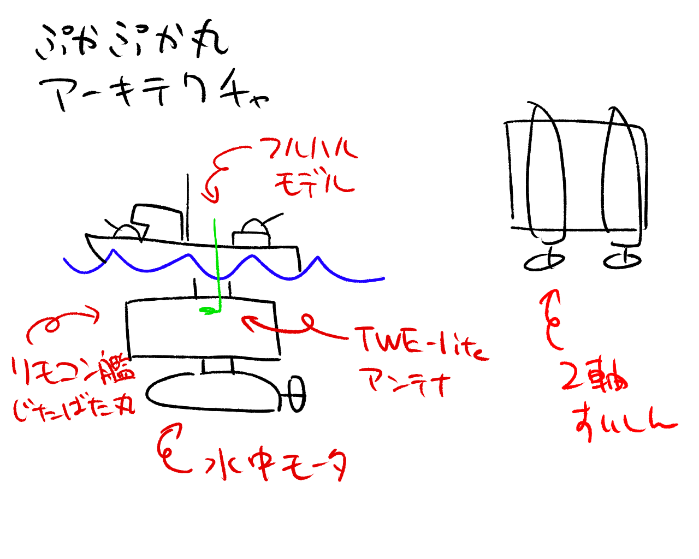

## 「プロジェクトぷかぷか丸」概要

 今回の計画を「プロジェクトぷかぷか丸」となんとなく命名、スタートしていくことになりました。

 計画の中核を担うコバンザメ式のリモコン艦は、白鳥はが泳ぐ際、水面上は優雅に泳いでいるのに対して、水面下ではじたばたと頑張っているという様子に見習い、「じたばた丸」と命名しました。

- プロジェクトの目的
    - 軍艦モデルを水上航行させて遊ぶプロジェクトです
    - 完全潜水型のリモコン艦「じたばた丸」に、小加工(水を入らなくする水密加工や浮力重量調整程度)を施したフルハル型の軍艦モデルを乗っけることで、あたかも軍艦モデルを操縦しているかのように動かせるのを第一目標とします
    - TWE-liteモジュールにて無線コントロールをします。親機はPCとし、将来的にはソフトウエアでの自動制御や複数人での操縦を見込む。
- やらないこと
    - 軍艦モデルを作りこむ。スクラッチする

　と、ざっくり目的を決めてプロジェクト開始です。General quaters!
 
# 技術試験一号艦

　とにかくまずは最低限の機能を満たすモノを作ってみるのが一番ですよね。

## TWE-liteとは？

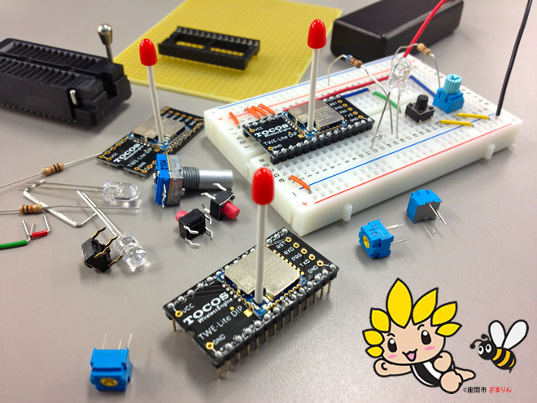

　TWE-liteとは[TOCOS wireless engine(東京コスモス電機株式会社)](http://tocos-wireless.com/jp/products/TWE-Lite-DIP/)が製造販売している、無線チップです。Zigbee規格の通信チップを、TOCOSオリジナルのマイコンとソフトで使いやすくパッキングしたモノ、という雰囲気です。公式サイトでは、いろいろできることを謳っていますが、そのせいかややぼんやりとした、捉えどころの分からない製品な雰囲気でした。

　よく読んでみるとZigBeeモジュールの仕様を特に気にせず使えることや、[TOCOSの標準アプリ](http://tocos-wireless.com/jp/products/TWE-ZERO/App_Twelite/)がマイコンに書き込んでありラジコン系の実装が簡単にできること、消費電力が低く間欠モードとボタン電池で年単位の稼働ができることをウリにしています。低速度通信を低消費電力で行う製品で、応用例としてはセンサー類を搭載して工場などの広い場所にばら撒いて使うセンサーネットワークが一番適しているようです。無線の到達距離は、付属の小さなアンテナで、見通し距離1km、密集地で100～200m程度が実用範囲とのこと。

　今回は単なるラジコンを作るチップとして使います。

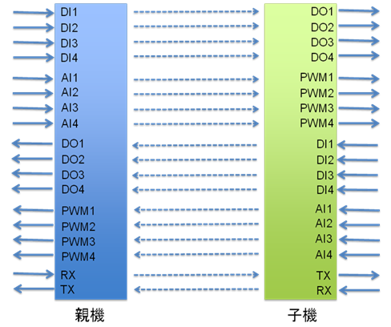

　ラジコンを作る場合、TWE-liteに最初から書き込んであるTWE標準アプリがまさにそのままラジコンの機能を提供してくれます。詳しい説明は公式サイトに譲りますが、TWE-liteのデフォルトでは、親機と子機のピン状態を20ms程度のズレで同期します。デジタル入力ピンはデジタル出力へ、アナログ入力ピンはPWMとして出力されます。

　PWMとは、詳しくはググってもらうとして、1,0しかないデジタル回路でアナログな出力を得たいときに使われる一般的な手法です。電圧を直接制御する代わりに、短い時間でON/OFFを繰り返すことで平均電圧を制御します。ON/OFFそれぞれになっている時間の比率をデューティー比と呼び、これを0%～100%の幅で変動させることで、電圧を0%～100%まで変化させているとほぼ同じ効果が得られるというものです。TWE-liteにはこのPWM機能が初めから内蔵されているため、何も考えずに疑似アナログ出力を得ることができます。便利ですね。

　今回は親機をPCとするため、TWE-liteシリーズ製品の[USBドングル"ToCoStick"](http://tocos-wireless.com/jp/products/TWE-Lite-USB/)を使い、ソフトから親機のピン状態を指定する形でいきます

　ToCoStickは専用のソフトがとりあえず用意されていて、それを使うことでざっくりとした制御ができます。が、TOCOStick自体がUSB-シリアル通信モジュールとTWE-liteがセットになったものでなので、自作のソフトで適当にシリアル通信すれば、PCやホストUSBを持つAndroidデバイスで制御できるようです。プロトコルも公式サイトのサンプルコードから読めるようです。今回はハード側の開発を先行させ、ソフトの開発を後回しにしたため、ここでは触れません。

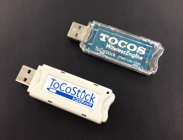

　ラジコンとなると個体管理が必要になりますが、TWE-liteではアプリケーションIDとチャンネルで個体識別ができます。チャンネルは、使用する電波帯域ですから今回のラジコン艦グループで1つ、一意に決めるのが良さそうです。アプリケーションIDは、子機に与えられる番号で親機からはこれを指定して送ること、それぞれ子機を区別できます。逆に親機が通信を受け取る場合、TOCOStickでは子機のIDが通知されるようです。アプリID、チャンネル回りの設定には、TWE-liteチップをPCにつないでシリアル通信のインタラクションモードで設定する必要があるとのことで、専用のライターTWE-liteRを買うのが早いようです。ということろまでは調べてますが、今回はこのあたりの個体管理までは検証できてません。

　とりあえず、将来的な拡張にも耐えられるということが分かったあたりで、建造に入ります。

## ざっくりシステム仕様

　まずはメインモーターこと主電動機を決めます。入手性と確実性からタミヤ製水中モーターをそのまま転用しましょう。これはかつてはマブチから出ていたキットとその改良版で、単三または単四電池1本で動くシンプルなモーターライズキットです。ちゃんと舵にサーボを付ける方法もありでしたが、構造がシンプルな方ということで、2機モーターを横に並べそれぞれの出力を制御して、旋回を行うこととしました。まあ、戦車のキャタピラと同じ要領ですね。今回は組み立てキット式の単四バージョンを使いました。
 
　モーターを決めたので、動力側電源が決まります。1.5Vですね。
 
　雑に考えればこれをTWE-liteに繋げばモーターが動くわけですが、残念ながら電子部品であるTWE-lite側が吐き出せる電力では、モーターを動かすには足りません。そこを仲介してくれるのが、モーター特化の制御トランジスタこと、モータードライバーICです。TWE-liteはちょっと困ったことに、最大電圧が3.6V。ボタン電池やより小電力な電源を使う場合には便利なんでしょうが、電子部品は5Vで動作するように作られてるものが多いため、3V駆動となると部品を結構選びます。またモータードライバの出力側も同様で、タミヤ水中モーター1.5Vのような小電圧はこれまた選びます。

　そんなわけで秋月電子の通販ページをぺらぺら見ているとよさそうなのがあるじゃないですか。[DRV777モータードライバ](http://akizukidenshi.com/catalog/g/gM-06540/)。データシート見てみれば制御側は1.6V以上、モーター側は0.4Vの電圧で動くようです。のちにこの選択がちょっと問題になりますが…

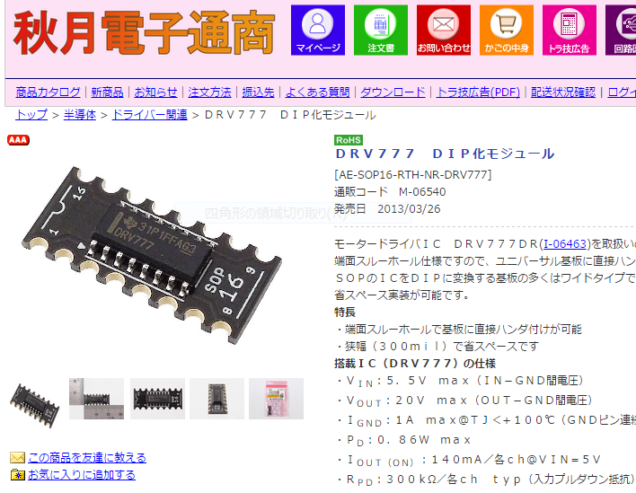

　そしてじたばた丸の心臓部TWE-lite。3V電源ということで単三電池を2本積むことにしましょう。動力電源が1.5V1本で、電子系が3Vで2本というのはなんだかバランスがおかしいですが、まあ試作なんでいいや。

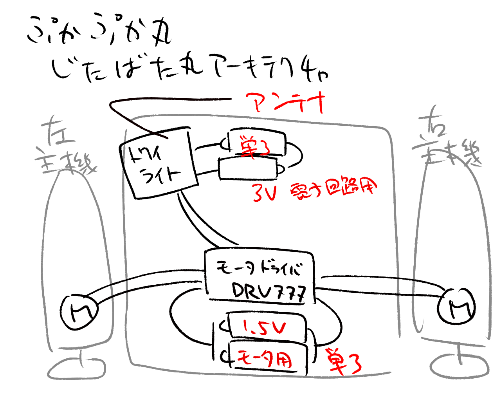

　船体はとりあえず水密が確実かつ安価なもの、ということで食品保存用のタッパーを転用しました。適当な百円均一で適当に用意します。

　さあこれでざっくりモノができそうな感じがしてきました。…あれ？電子工作らしい部品が全然ないんだけど、大丈夫？

## 建造

　パーツ数が少ないのでちゃっちゃとはんだ付け。なんとその数2点。

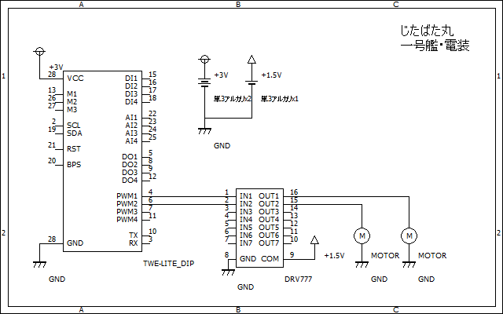

　回路図とか書いてますけど、これは完成したあとにでっち上げw

## 試験チャンバーでの浮力試験

　水中モーターは電池部が空洞だと浮力過多になってしまうため、後々使予定だった鉄玉を詰めておきます。100均で適当なサイズのタッパーを見繕って、回路類を一通り詰めていきます。モーターの配線はタッパーに穴をあけて通し、あとからホットボンドで塞ぎます。

　できたらとりあえず浮かせて、ToCoStickアプリから操縦してみます。

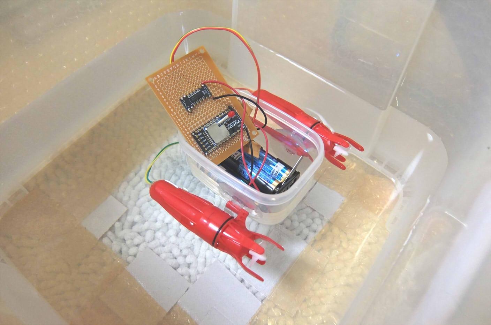

 　う、動いた！

　こんなシンプルな部品数でいいんだろうか…。TWE-liteにモータドライバIC1個しかないけど、ちゃんと動くのは感動ですねえ。

## 残り作業

　じたばた丸は自身の船体を沈めて隠す必要があります。それを実現するために、水面ギリギリにフロートをつけ、それで何とか浮くように重しを乗せることにしました。フロートは工作用スチロール板を切り出汁、軍艦モデルを支える柱を兼ねるようにします。

　浮力が多すぎる場合は、ウエイトを内外に取り付けて沈めます。ウエイトには、アマゾンで安かった鉄球(スリングショット用)と、鉛テープを使いました。

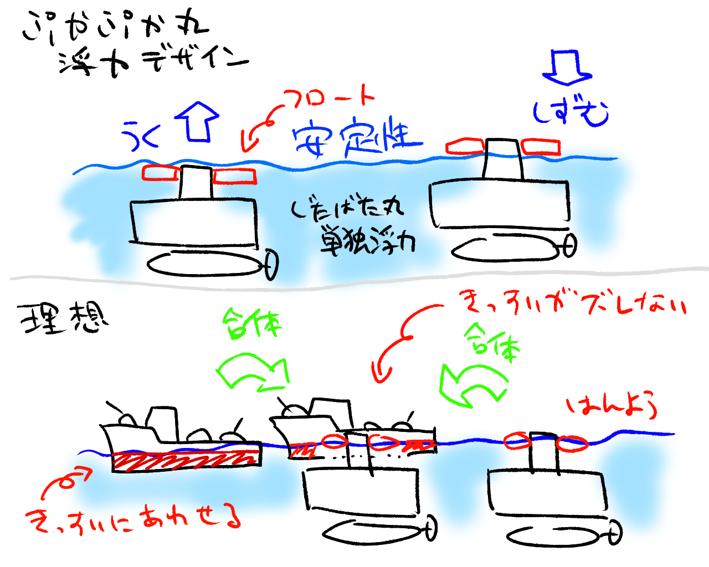

　試して見ると浮力は相当余剰があるようで、電気系の2倍以上の重さの鉄球を積むことになりましたが、まあいいでしょう。最後にじたばた丸全体をグレーで塗装し、軍艦モデルを作って(これが一番手間かかるとも言う)上に張り付けて完成。モデルは試作ということもあり、アマゾンで一番安く作りやすそうなアオシマの駆逐艦磯風(フルハル)としました。船底は水密にしておき浮力を生むようにしたかったのですが、難しかったためスチロールを詰めて同じく船体が水面上に出やすくしました。

## どう見ても宇宙駆逐艦

　試作一号艦ができました。僕がTWE-liteとタッパーと格闘している間に、@greenspaが初プラモで磯風を完成させてくれました。そう、建造時間は2人日程度。ペコポーン♪(艦これSE)

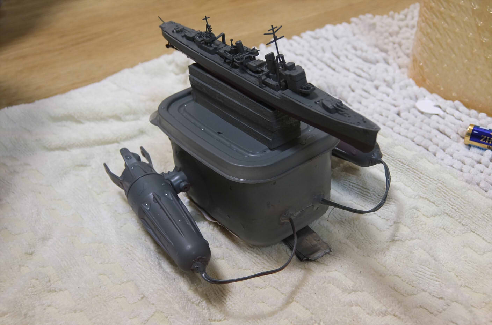

　ってなんじゃこりゃあああ。うーん、機能と部品と設計は間違ってないんだけど、タッパーがデカいのと左右の水中モーターが主張しまくりで、当初のイメージからはかなりズレたものになりました。スタートレックのUSSエンタープライズか何かですねコレは。駆逐艦磯風は改装で宇宙駆逐艦磯風になってしまいました…

# 一号艦、公園じゃぶじゃぶ池海域に出撃す！

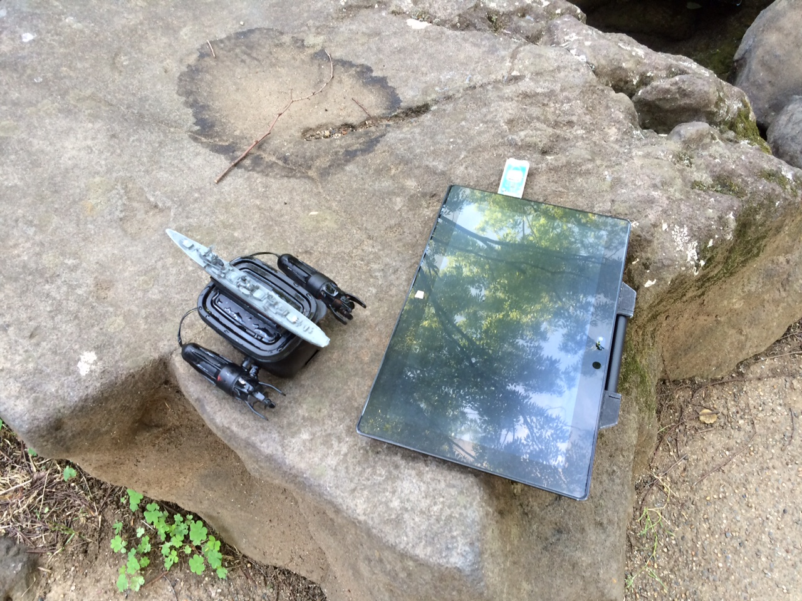

　バケツ試験チャンバー内での動作確認を済ませたら、適度な広さの水辺に行って試験航海をしましょう。

　気楽に使えて、そこそこ広く、じたばた丸の船体が擦らない程度の深さがあり、制御不能/沈没時にはサンダルとかでざぶざぶ歩いて救出にいけるような水辺…。
 
　そう、公園です。といっても、柵があったりするような池ではなくて、ちびっこの水遊び場として作られた「じゃぶじゃぶ池」がまさに最適でした。水深が20cm以下でそこそこ広く、流水があって水がきれいです。ご近所さんの目線が若干刺さりますが、振り切っていきます！いやっほーい

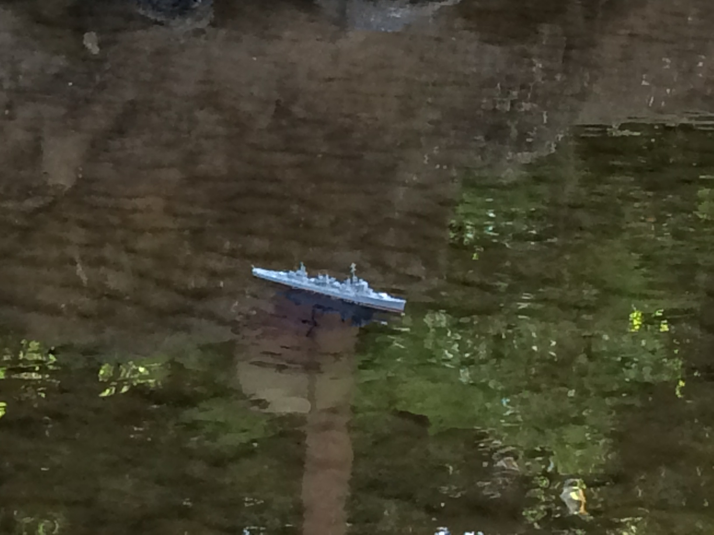

　こ、これは…！ちゃんと動く！(推力不足と直進性不足でまともな操艦になってなし、水流で流されてるだけだけど)優雅に航行できてる(ように見えてる)！カッコいい～

# 二号艦への課題

　試験航海からいくつかの成功と課題が発覚しました。

## じたばた丸のコンセプトは正しかった

　池の底が明るい色だったり、船の直上から見た場合はともかくして、船体に対してじたばた丸自体はあまり目立たず、ちゃんと軍艦モデルが自力航行しているように見えました。これには驚きました。バケツ内での浮力調整のときには、透明なバケツでやっていたこともあってか、かなり間抜けな姿になるのではないか？と危惧していたのに、このコンセプトがちゃんと実用レベルだったことはとても重要な成功です。

　特に水面が反射するような浅い角度や、水面が太陽光で光る逆光のシチュエーションではバッチリ隠れて最高にカッコイイ…。逆光下で旋回すると側面がキラッと反射したりもう最高！

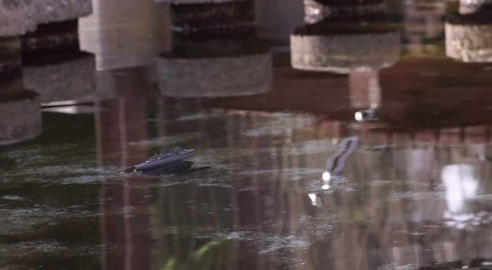

## やや心配だった電波強度は大丈夫そう

　一般に水面下からの電波は届きません。というのも水面が反射してしまうからなんですが、例えば現実の潜水艦は通信のためにわざわざ水上へ浮上したり、通信用ブイを浮かせたりします。

　まあ今回は水深数センチ程度だし、km単位で届く無線を数m距離で使うのだから、大丈夫だろうと踏んでいたところ、どうやら問題ありませんでした。最悪問題があれば、別売のアンテナ線を付けてアンテナだけ水面から出すというようなことも考えてましたが、杞憂に終わりました。むしろ、タッパーに詰めるときアンテナが邪魔になるため、二号艦ではアンテナ内臓版のTWE-liteを使うこととしました。

## 推力は不足。電源強化が必要

　電源1.5Vでは推力不足でした。じゃぶじゃぶ池は見ていてわからない程度に緩やかに流れているのですが、川上に向けて静止するのがやっとなほど推力が不足していました。

　あとでデータシートを確認して気づいたのですが、モータードライバには内部抵抗が1Ω(0.5Ω～1.5Ω幅)で存在することから、想定より相当電圧が下がっていたようです。また、電源を単三電池1本1.5Vに対して、モーター2個を駆動するという設計だったのもマズイようです。電源強化が必要でした。

　他にも、PWM出力ではデューティー比60%以上でないとモーターが回転開始しませんでした。電源の電圧アップでおそらく改善すると思いますが、TWE-liteの設定でPWM周波数の調整ができるとそれも影響するかもしれません。PWMによるモーター制御は、電圧変化によるモーター制御より、低速回転のレンジが広いといわれてますが、電圧不足ではそもそも立ち上がりが悪くなるのは仕方ないのかもしれません。

　さらに調べて見ると、タミヤ水中モーターに使われているモーターの交換品のデータシートを、せんごくネットで見つけることができました。それによると定格でこのモーターは3Vを受け付けるようです。定格ということはもうちょっと上の電圧でもPWM通せば問題なさそうですね。次の船体では3V前後の電源(エネループ1.2Vx3=3.6V)を用意して、出力向上とPWM制御精度向上を狙うこととします。

## 直進安定性が低い。船体構造が悪い

　全然まっすぐ進みません。操作している間は、PWM出力で左100に対して、右96ぐらいでだいたい直進する感じでしたが、右を97にするとガッツリ左旋回を始めるし、右を95にすると実際の船なら面舵いっぱいといった雰囲気で右旋回をしてしまいます。

　おそらく原因はいくつかあるようです。

　まずは船体。真四角のタッパーをバカ正直に配置してるため、正面に当たった流水が左右に分かれる際、左右のモーターのわずかな出力差で左に流れるか右に流れるかが決まってしまうようです。やはりちゃんとした船体のように船首と船尾を三角形にするなり、潜水艦のような滴涙型(ティアドロップ)にするのが良さそうです。

　もう一つはモーター制御側。今回の単三乾電池1.5V1本に頼る電源は、モーター2系統を動かすには足りないようで、左右同時に動かした場合はモーター音がやや低くなりました。ということは、PWM制御で片方が止まっているとき、もう片方の動ているモーターは、2系統のモーターを動かすときより多くの出力を出せることになるでしょう。この対策には、モータドライバの直前にバイパスコンデンサを用意して、電源の安定化を図るのが良さそうです。

## モータードライバに逆転機能がない

　これは完全にウッカリでした。注文時にちゃんと確認するべきでした。DRV777はステッピングモーター等に使う用のモノポールタイプだったのです。逆転機能を有するのはフルブリッジドライバであり、そちらを使うべきでした。

 とはいえ、1.5Vで使えるモータードライバは他に見当たらなかったので仕方ありません。次では動力電源を1.5Vから3V前後に変更するので、モータードライバの選択で悩む必要はなくなりました。まっとうなモータードライバを選択して、TWE-liteのデジタル出力DIOの制御で逆回転できるようにします。

## コントロールソフトが暫定すぎる

　今回とにかく動くことを目標にしたため、制御ソフトはTOCOS提供のWindowsアプリにしました。このアプリはとりあえずの検証をするには問題ありませんでしたが、ラジコン操作をするには不便です。操作の度に、スライダでPWM出力値を決めて送信ボタンを押す必要があって、低い直進安定性と相まって思い通りに操縦はできませんでした。

　次はこの辺もちゃんと用意するようにしましょう。

## 遊んでるとちびっこが襲ってきたり、爺さんに声を掛けられる

　まあ当然なんですがw 割と目立ちます。

　ちびっこは勝手に動く船の方を気にして、じたばた丸に近づいてきますし、散歩中らしい爺さんも寄ってきて船の説明をしたり。これはこれで楽しいですね。僕らも、もっと公園に出て水遊びをするべきですな～。

# 二号艦

　さて、一号艦の実証実験から、二号艦での改良点をリストしました。

## 電装系改良

　改良された二号艦の回路図はこうなりました。

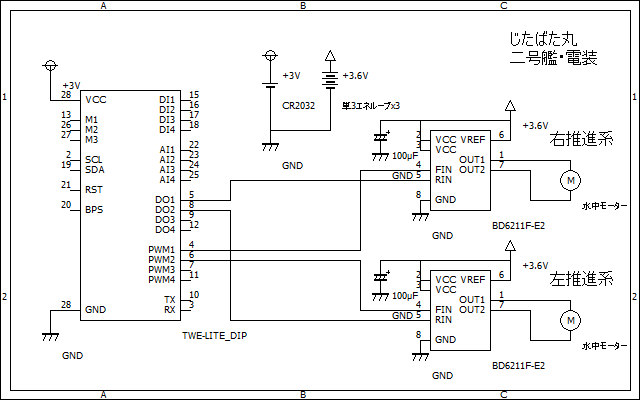

- モータードライバを[BD6211Fフルブリッジドライバ](http://akizukidenshi.com/catalog/g/gI-05087/)に変更。合わせて動力電源を3.6Vに
    - 電源安定化のため、モータードライバ直前にはパスコンも付けてみました
- TWE-lite側電源はコンパクトにボタン電池CR2032へ
    - TWE-liteは省電力が売り(設定次第ではボタン電池で年単位の稼働ができる)の無線チップなので、数時間遊ぶにはこれで足りるはず
- 各種コネクタを付けて、モーター(船体と接着している)と電池ボックス、回路を分離可能に
- はんだ付け簡略化のために、ブレットボード風ユニバーサル基板を使ってみた

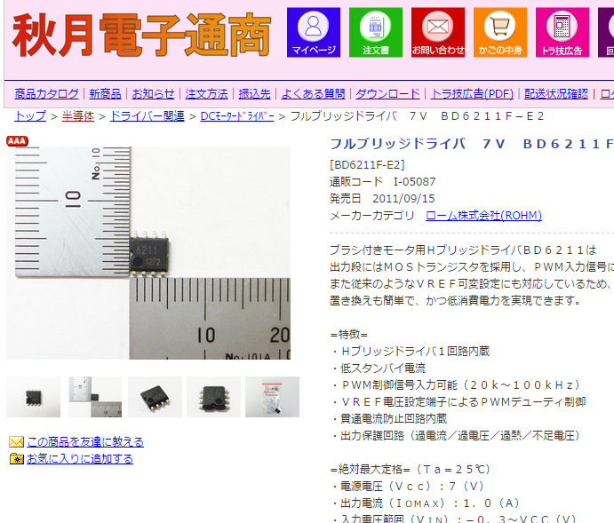

　という感じで。パーツを買ったらあとはザクザクはんだ付けしていくだけ。ちょっと大変だったのは、BD6211Fが予想に反してSOP8(1.27mm間隔)ピンだったことですね。仕方ないのでSOP8とDIP変換基板を買ってきてちまちまはんだ付け。

 
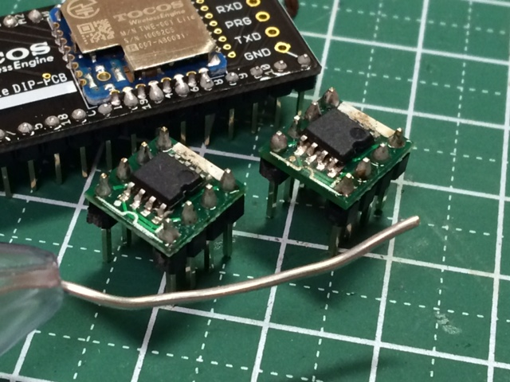

　動作検証してみると、モーター電源強化はかなり効いたようで、モーター駆動音も一号艦とは比べ物にならないぐらいパワフルな音になりました。また一号艦ではPWMのデューティー比60%以上でないとモーターが回り始めませんでしたが、二号艦ではデューティー比30%から回転するようになりました。実際の成果は水上へ出てみないと分かりませんが、かなりの推力アップと操艦しやすさが上がっていることでしょう。

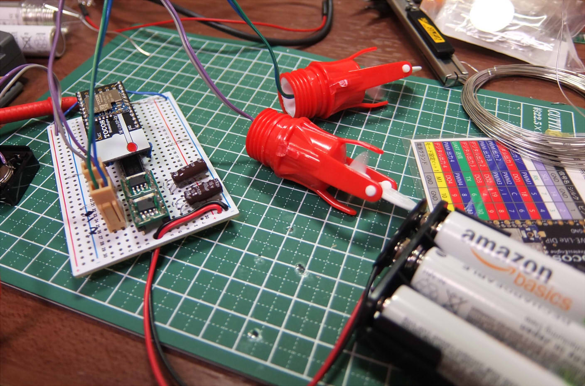

## 船体改良

　一号艦はとりあえずの水密性能を第一にしていたため、食品用タッパーを利用していましたが、二号艦はせっかくなので手持ちのFDM式3DプリンタUp!plus2で船体を組むことにしましょう。

　3Dプリント自体はコップが作れる程度には水密性がありますし、自由な設計ができます。パーツ類の取り付けを確実にして、重心や推力中心を固定するのは水に浮いているものにとって大切です。データさえ残しておけば、ほぼほぼ同じものが再生産できるのも素晴らしいメリットです。

　3Dプリント自体はコップが作れる程度には水密性がありますし、自由な設計ができます。パーツ類の取り付けを確実にして、重心や推力中心を固定するのは水に浮いているものにとって大切です。データさえ残しておけば、ほぼほぼ同じものが再生産できるのもメリットになります。

　モデリングソフトはこれまで使い慣れたAutoDesk 123D Design(Windows/Mac/無料)を使います。123D Designはななかインサイドでもしばしば(僕の記事で)登場していますが、最近のアップデートでどんどん安定してきており手放せないツールになってきています。生物的な造形や既存のSTLモデルを編集するといったことはできませんが、立方体や円柱といった単純図形を組み合わせて工業的造形をするにはとてもお手軽です。3Dプリンティング向けに特化していることもメリットですね。

　モデルデータを作る前にざっくりイメージを決めます。TWE-liteが乗った基板と電池ボックスを船体中央に配置し、特に電池は船体底面に置いてバランスウエイトとしましょう。これらを格納する、前後に細長い直方体を船体基礎とします。一号艦ではタッパーの横に吸盤で取り付けていた水中モーターは、電池ボックス部が余計な浮力発生源となってしまっていたのでバッサリカット。プリント船体の後ろに付けることとします。四角い箱からしっぽが二本生えた形状になりました。水流を考えて船体前後を三角形にし、船首を付けましょう。上にフタを付け、これをとりあえずはゴムバンドでぐるぐる巻きにする方針にします。フタと船体の隙間は、アマゾンで見つけたゴムシートを切って貼り、残りの隙間はグリスを充填してなんとかする方針にします。

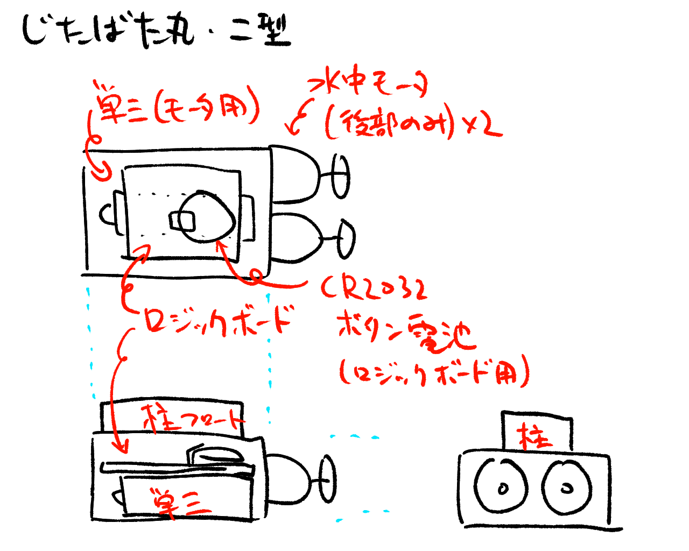

　イメージができたら、内部回路と電池ボックス等の容積、水中モーターの外形を定規やノギスで測って、モックモデルを123D Design上で作ります。配線スペース等をダミーブロックとして作り、グループ化して内部構造とします。その後、これが収まるように寸法の箱を作り、船体とします。船体を適当に変形させ、船体の形が決まったら、先に作っておいた内部構造とSubtract機能で結合すれば、船体から内部構造分がくり抜かれて出来上がり。

　追加で電池ボックス下に鉄球を入れられるようにして、重量バランスの調整をしやすいようにします。1cmの鉄球を仕込む用に、1.1cmの円柱で穴をくり抜いておきました。

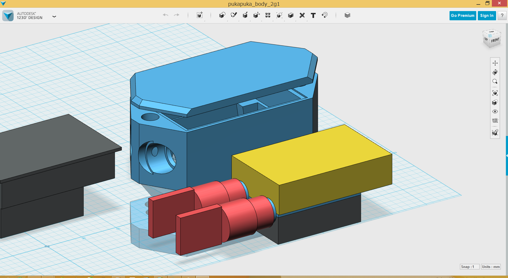

# 新船体テスト

　とかまあ、そんな感じで作ったら、STLファイルに出力して、プリントです。プリント所要時間4時間程度、消費フィラメントは100g弱。…、1巻4500円ぐらいだから、1船体で650円ぐらい？プリントを開始したら、はんだ付けやらWoWsやらスプラトゥーン(ローラー派)をして待ちましょう。

## 一回目プリント(サイズ検証)

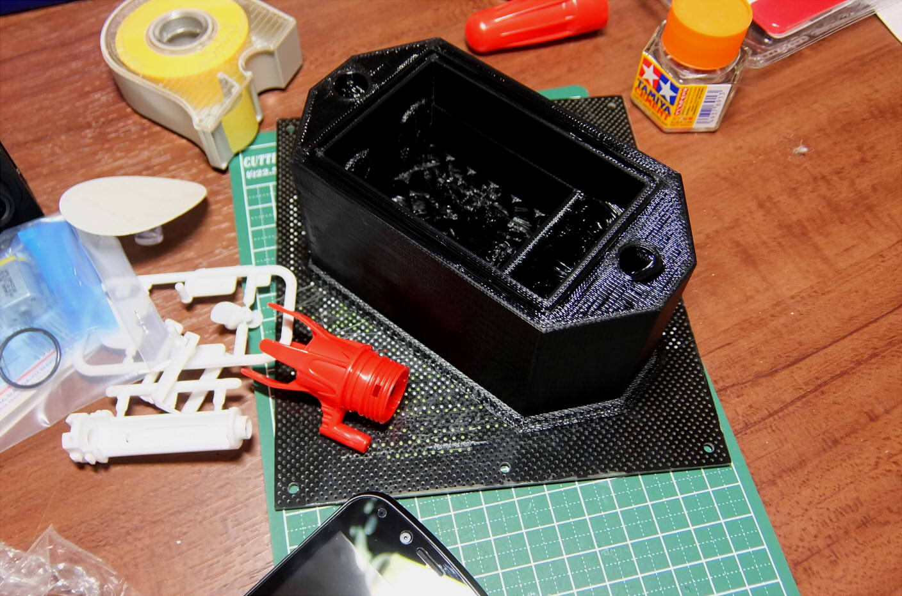

　一回目はとりあえずちゃんとできるかな？寸法あってるかな？検証ということで、船体のみをとっとと使い潰したいノーブランド品のABSフィラメント黒で出力。このフィラメントはあまりUp!plus2との相性がよくないよう(おそらく径が太い？)で、サポート/ラフトが張り付けて取れないことが多いですが、サイズ検証ぐらいには耐えられるので使い切るまで使おうとしているものです。

　モデルデータはUp!Plus2のプリントスペースにかなりギリギリです。あと2cmぐらいしか余裕がなさそう。やっぱり12cm角程度のプリントスペースしかないUp!Plus2は、モノを入れるようなケース類にはやや厳しいですね。

　出力してみると、思っていたよりデカい。やっぱり現物があると実感が違いますね。モーター取り付け穴のサポートは案の定剥がれませんでしたが、寸法はあっているようです。基板も入りそうだけどクリアランスはぎりぎり、要調整。船体側面は、フタのゴムパッキンを考慮して幅広5mm程度にしましたがオーバー過ぎたようです。スリム化しておきましょう。

## 二回目プリント(浮力チェック)

　二回目出力はちゃんとギミックが試せるよう、船体のフタを作っておきます。船体底面を複製した後、Extractして板を作り、かみ合わせるためのダボ穴/ダボピンを船体とフタに追加します。また内部構造に船体とフタの隙間を埋めるゴムシート部を追加し、くり抜いておきます。3mmゴムシートに対し、船体側とフタ側に1mmのくぼみを設けました。1mmもバッファがあるのはオーバーかもしれませんが、まだ知見がない以上余裕を持って作っておきます。

　FDM式3Dプリントの場合、極々少しですがモデルよりプリント結果が大きくなります。ダボ穴のように奥まった場所だと、サポート材やラフトが剥がせないないことが起きるため、それを考慮してモデリングする必要があります。こういったパーツを設計する場合、自分の経験ではプリント横方向に対しては0.5mm程度、プリント縦方向に対しては1mm程度のクリアランスを用意するといいようです。

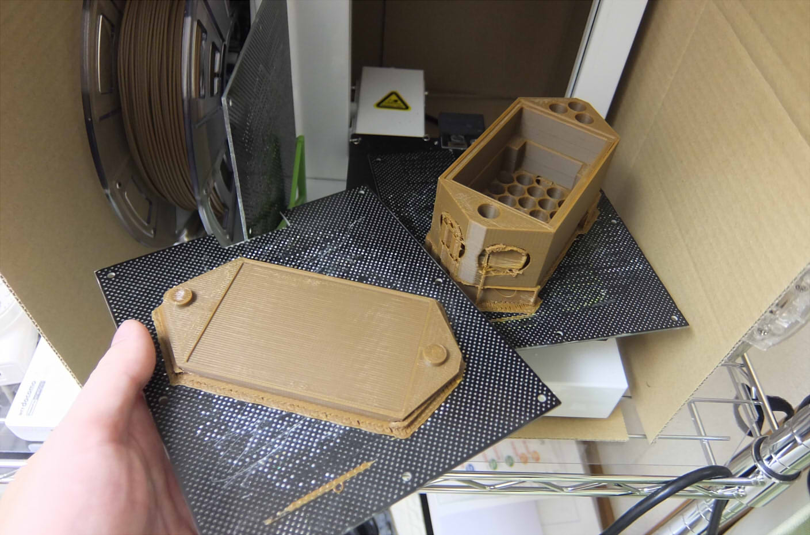

　出力したモデルに仮組した水中モーターを取り付けてみると、なかなかバッチリ。接着なしでもスナップフィットのプラモデルのように摩擦で保持してくれます。水密はマズそうですが、後々ホットボンドで隙間をふさぐつもりなので、とりあえずは後回し。

　重心バランスを見るために電池ボックスを本番同様設置して、試験チャンバー(洗面台)に浮かべてみます。おっとモーターの分、後ろが重いようです。浮力を相殺してみるために、一回目プリントで作っておいた鉄球穴に、アマゾンで買っスリングショット用鉄球を入れてみます。が、全然沈まない…。3Dプリント体は内部が中空になることや、元々フィラメントの比重がそれほど重くないことからアッサリ浮いてしまう模様。これは厳しい。

　仕方ないので、鉄球より比重に優れる鉛玉を注文しつつ、モデルデータを修正。船体底のウエイトを仕込めない空間をできるだけ削り、浮力を削減しつつ、船首と船尾のダボ穴とその周辺にも鉄球ウエイトを仕込む空間を作ることとします。

## 三回目プリント(水密チェック)
　三回目でどうだ！そろそろモーターを船体に固定して、ホットボンドで隙間をツメます。二回目同様にウエイト鉄球と電池ボックスを仕込んで、船体をゴムバンドでがっちり固定したら、いざ洗面台へ。

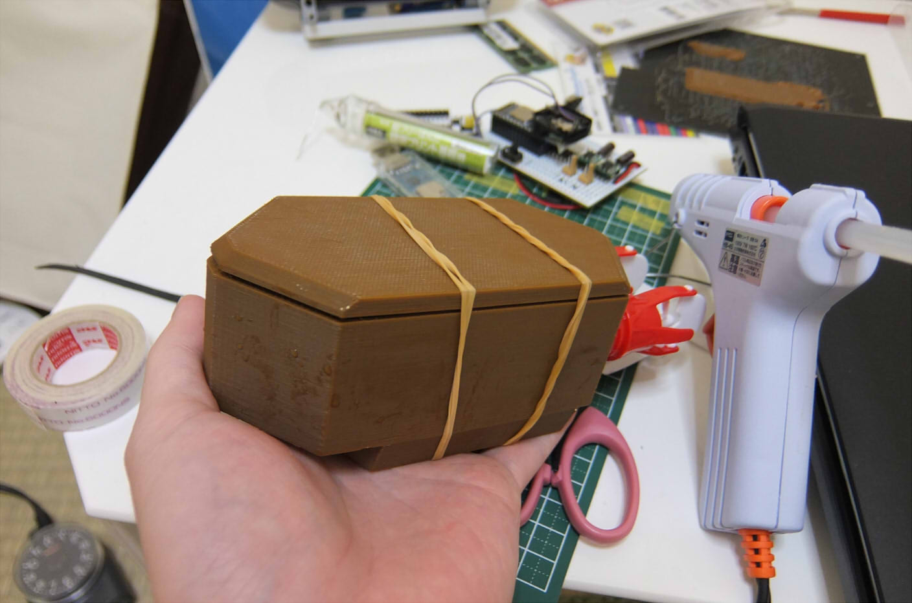
 
　追加したウエイト鉛玉と浮力削減はうまく行ったようで、ギリギリ沈むようにはなりました。が、水密は足りないようで、1秒に1個程度の空気漏れと浸水があります。最初はゴムシート周辺が問題かと思い、設置面をヤスリで削ったり、グリスアップをしてみたものの改善せず。いろいろ試行錯誤したところ、ウエイトを外した状態でもモーター周辺から浸水があるようです。

　水密はなかなか一筋縄では行かないようです。こりゃ、陸軍がまるゆ建造で苦労するわけですよ

# 俺たちの建造はこれからだ

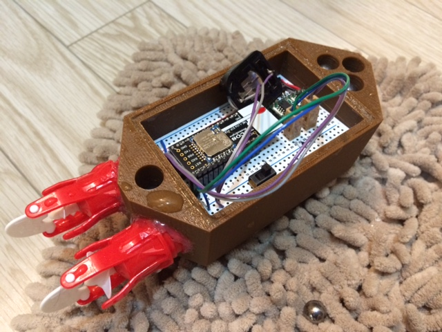

　ということろで、原稿の締め切りが来てしまいました。ざんねん。やはり自作船体での水密は確保は難しかった、というところですね。しかしTWE-liteによるラジコン作成は思いのほか簡単にできることが分かりました。

　今後の予定としては、二号艦の完成とリモコンソフトの開発をめざし、その後は複数台の艦隊ごっこをやったり、ToCoStickが刺さったPCを中心にリモコン操作のネットワークを作る等したいと考えています。測量システムが作れれば(音波センサか何かを考えてます)自動運転もできるかもしれません。

　逆にTWE-liteをより大型な軍艦モデルのモーターライズ方面に強化するのもよさそうです。TWE-liteにはDIOとPWMが4ポートずつあるため、砲塔にサーボを仕込んで動かしたりもできるでしょう。TWE-liteはなかなか夢が広がるチップです。

　最後にぷかぷか丸計画にノリノリで賛同し協力してくれた@greenspaに感謝。

