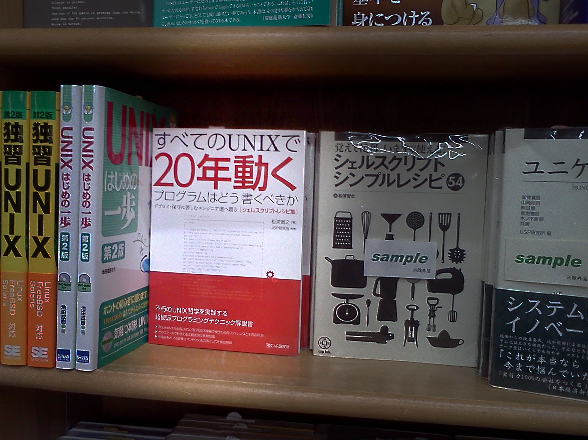
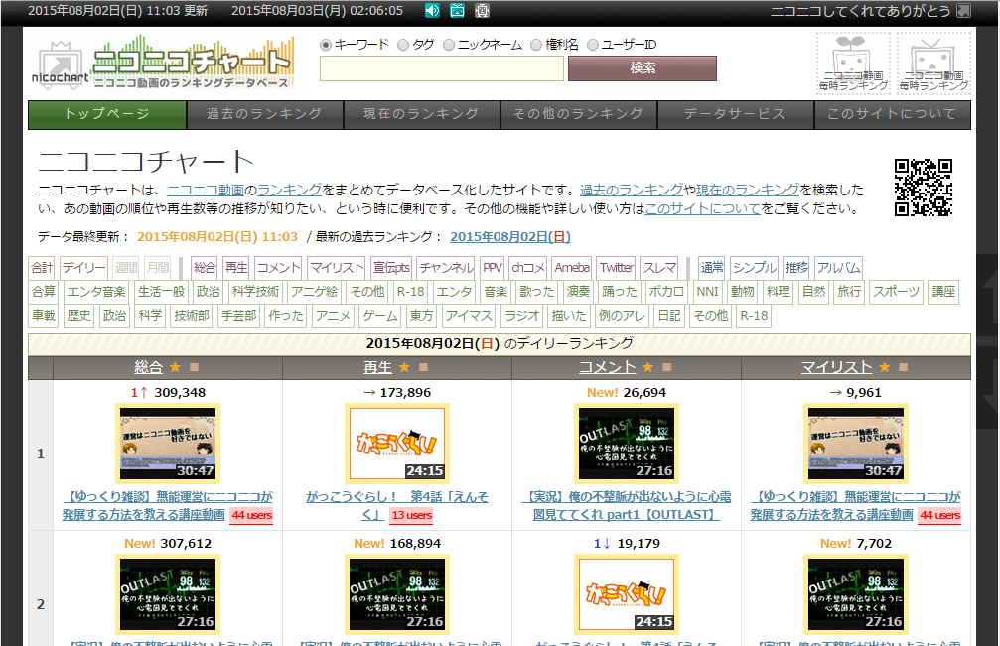
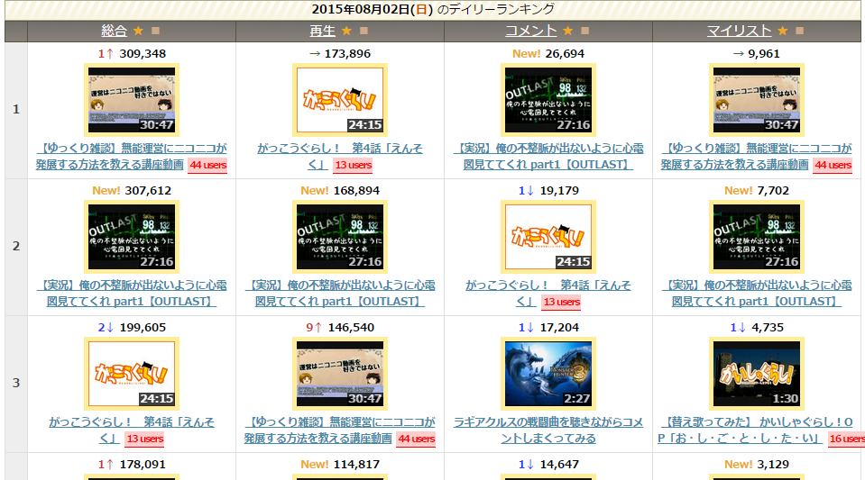
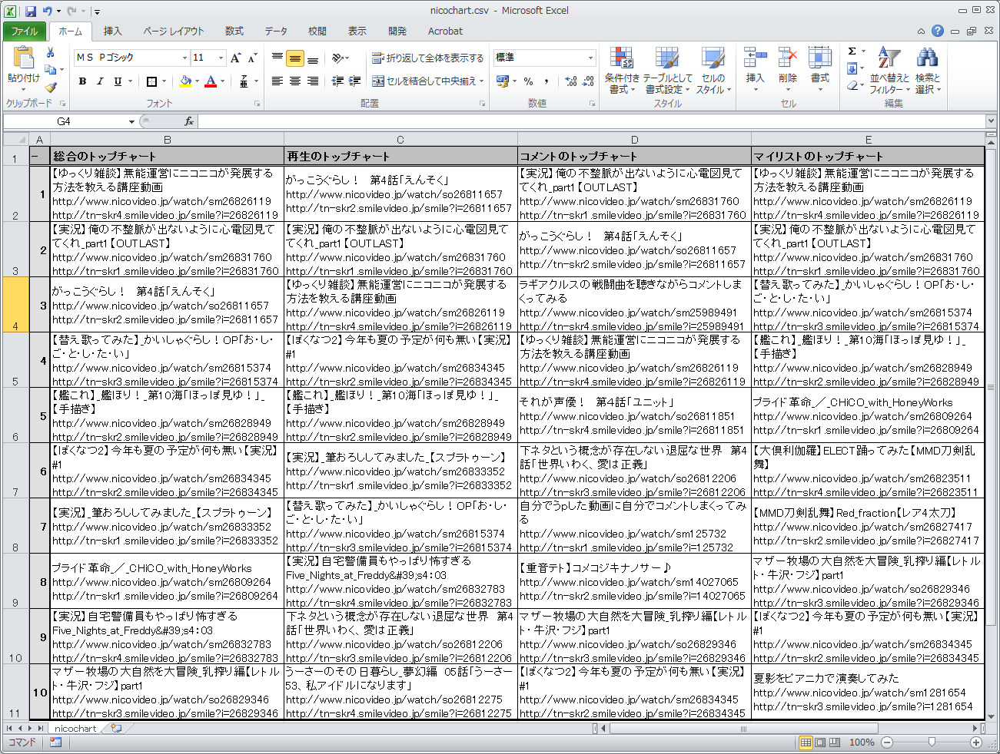

Title: 恐怖！ハードスクレイピング男
Subtitle: POSIX原理主義者が教える恐怖のスクレイピング
Author: @richmikan
Author(romaji): Rich Mikan

<!-- 元ネタ http://qiita.com/richmikan@github/items/024b1f3869c84b9a3a21 -->
<!-- 記法   https://github.com/naoya/md2inao                             -->


# 恐怖！ハードスクレイピング男

説明しよう。この記事は、POSIX原理主義で世のプログラマーを洗脳し、世界征服を目論む「秘密結社シェルショッカー」の日本支部長、リッチー大佐が、何の言語もライブラリーも使わず、どのUNIXにも最初から入っているsedやAWKといっコマンドだけでHTMLを読み解くという、ベリィ・サディスティックなスクレイピングを見せつける記事なのだ！

## 本の姿をした怪人を書店へ送り込んだ！

　全世界70垓人のプログラマーどもよ、ごきげんよう。私は偉大なる秘密結社シェルショッカーの日本支部長、リッチー大佐である。今日も泣きながらプログラムの書いておるのではあるまいな。よしよし、ならば我々の組織に入隊することを検討するがいい。今日の話を始める前に一つ、我々の侵略活動の一端を見せてやろう。



先月、

> **本型怪人「すべてのUNIXで20年動くプログラムはどう書くべきか」男**

という怪人を我々の日本支部の管内である日本全国の書店に送り込んだのだ。正々堂々と世界征服をしてもよいが、書店員の目を欺くためにこの私が世を忍ぶ仮の名前を使い、この怪人を製造したのだ。書店のコンピューター書売り場を見てくるがいい。訪れた客たちが、新たに我ら組織の思想に洗脳されていく様を！ハッハッハ……

　メトロパイパー男による侵略は、東京メトロイダーの手引きにより奇しくも失敗しおったが、今度こそ成功させてやる。見ておれぇぇ！


## 今日は究極のスクレイピングだ

　さて、今日お前たちに見せてやるのは、シェルショッカー流のWebスクレイピングテクニックだ。

　Webは今や、世界征服を実行するうえで欠かせない存在となった。Webメディアに群がる人間どもを洗脳するためにも重要であるが、作戦を立案すべく諜報活動を行うための重要な情報源でもある。その第一歩は、人間どもが何の危機感も抱かず公開しているWebページのスクレイピングである。

　ではそのスクレイピングをどうやるか。何、DOMライブラリーだとぉ？そんなものを使ったら、POSIX原理主義を崇拝する我らが世界征服をする意味がなくなってしまうではないか。どうやらお前達は、まだ洗脳が足りておらんようだな。よぅし、ならば早速スクレイピングの奥義を目に焼き付けさせてやる！

## スクレイピングの秘密兵器

　DOMライブラリーなんぞ使わんと言ったが、かといって丸腰というわけではないぞ。スクレイピングのために、POSIX原理主義を厳格に守りながら開発した秘密兵器が我々にはある。[Parsrシリーズ](https://github.com/ShellShoccar-jpn/Parsrs)と名付けた各種テキストフォーマットパーサーのうちで、XMLパース用に開発した「X」こと[**parsrx.sh**](https://github.com/ShellShoccar-jpn/Parsrs/blob/master/parsrx.sh)を使うのだ！前回（メトロパイパー男の回）でも説明したが、もう一度説明してやろう。

### Parsrx.shの威力

　こいつの威力は絶大だ。例えば次のようなXMLがあったとする。

```
<文具購入リスト 会員名="文具 太郎">
  <購入品>はさみ</購入品>
  <購入品>ノート(A4,無地)</購入品>
  <購入品>シャープペンシル</購入品>
  <購入品><取寄商品>替え芯</取寄商品></購入品>
  <購入品>クリアファイル</購入品>
  <購入品><取寄商品>６穴パンチ</取寄商品></購入品>
</文具購入リスト>
```

　これを我らのXMLパーサーにかければこうなる。

```
/文具購入リスト/@会員名 文具 太郎
/文具購入リスト/購入品 はさみ
/文具購入リスト/購入品 ノート(A4,無地)
/文具購入リスト/購入品 シャープペンシル
/文具購入リスト/購入品/取寄商品 替え芯
/文具購入リスト/購入品
/文具購入リスト/購入品 クリアファイル
/文具購入リスト/購入品/取寄商品 ６穴パンチ
/文具購入リスト/購入品
/文具購入リスト \n  \n  \n  \n  \n  \n  \n
```

　元のXMLデータにはもちろん各種の値が格納されているわけだが、それぞれの値がどのタグや属性の中に格納されているかが重要だ。タグは階層構造をとっているのでファイルの格納場所をパスで表現するのと同様に、XML用のパスで表現する方法がある。それが**XPath**と呼ばれるものだ。このXPathを、値の手前に添えながら1つの値を1行で表現している(値の中に改行があるものは`\n`で表現する)。

　XPathでは、タグの入れ子構造はスラッシュ“`/`”で表現し、タグの中の属性名はその手前に“`@`”を付けることによって表現する。この規則を踏まえて元のXMLと上記のXPathを見比べれば、その関係は容易に理解できるな。

　こうすると何が嬉しかといえば、UNIXコマンドで好きなように料理できるようになるということだ。例えば、店に並んでいない取り寄せ商品の一覧が知りたければ、パース後のテキストデータに対して`grep '取寄商品' parsed_data.txt`などと書けばよい。さらに、それが何個あったか知りたければ`grep '取寄商品' parsed_data.txt | wc -l`と、後ろにパイプでコマンドを繋げばよい。UNIXコマンドとの相性もばっちりではないか。

### 28個のPOSIXコマンドでできている

　parsrx.shがどうやって変換しているかについての説明は省略するが、cat、sed、AWK、trという4種類のコマンドを計28個、パイプで繋いでいるだけだ。だから、ワンライナーで書こうと思えば書けなくもない。嘘だと思うならソースコードを見てくるがいい。

```
https://github.com/ShellShoccar-jpn/Parsrs/blob/master/parsrx.sh
```

　そしてもちろん、上記のコマンドはPOSIXの範囲で使えるオプションや機能しか用いていない。我らはPOSIX原理主義を崇拝しているからな。

### 怪人誕生！

そしてこの兵器を搭載した新たな怪人を製造したのだ。見るがいい、**恐怖！ハードスクレイピング男**だ。この男はさっき紹介した本型怪人のDNAを移植しておってな、顔面がその本になっておる。ゆけ、ハードスクレイピング男よ！世の中のヌルいWebスクレイパーを滅ぼすのだ！！！


## ターゲットはどいつだ

　俺はハードスクレイピング男。リッチー大佐の命令により、世界中のあらゆるWebサイトをスクレイピングすることが使命だ。さぁて、最初にどのWebページを我らのスクレイピングの餌食にしてやろうか……。

### ニコニコ静画


ほほぅニコニコ静画か。「春」というJailがので有名だな。フッフッフ、まずはこのサイトをターゲットにしてやるか。よし、parsrx.shでパースだ。喰らえぇ！（リスト1だ）

    ●リスト1::ニコニコ静画TOPをXMLパーシング
    $ curl -s http://seiga.nicovideo.jp/ | ./parsrx.sh
        :
    /html/head/meta/meta/meta/meta/meta/meta/link/link/link/body/div/div/div/div/div/div/div/d
    iv/div/div/ul/li/a/li/a/li/a/li/a/li/a/li/a/li/a/li/a/li/a/li/a/li/div/div/div/div/div/div
    /div/div/div/div/a/div/div イラスト
    /html/head/meta/meta/meta/meta/meta/meta/link/link/link/body/div/div/div/div/div/div/div/d
    iv/div/div/ul/li/a/li/a/li/a/li/a/li/a/li/a/li/a/li/a/li/a/li/a/li/div/div/div/div/div/div
    /div/div/div/div/a/div/div/@class summary_comment
    /html/head/meta/meta/meta/meta/meta/meta/link/link/link/body/div/div/div/div/div/div/div/d
    iv/div/div/ul/li/a/li/a/li/a/li/a/li/a/li/a/li/a/li/a/li/a/li/a/li/div/div/div/div/div/div
    /div/div/div/div/a/div/div/span/@class comment_txt
    /html/head/meta/meta/meta/meta/meta/meta/link/link/link/body/div/div/div/div/div/div/div/d
    iv/div/div/ul/li/a/li/a/li/a/li/a/li/a/li/a/li/a/li/a/li/a/li/a/li/div/div/div/div/div/div
    /div/div/div/div/a/div/div/span ええ乳やこれは・・・ がわ゛い゛い゛な゛ぁ スレンダーNDK な
    でにゃんなでなで かわいい
    /html/head/meta/meta/meta/meta/meta/meta/link/link/link/body/div/div/div/div/div/div/div/d
    iv/div/div/ul/li/a/li/a/li/a/li/a/li/a/li/a/li/a/li/a/li/a/li/a/li/div/div/div/div/div/div
       :

　ギャァァァ！な、なんだこれは（リスト2）！いくらなんでもこんなに階層が深いわけがない。一体もとのHTMLソースコードはどーなっているんだ!?

    ●リスト2::ニコニコ静画TOPのHTMLソース
        :
    やったぜ コマ！？さんは登場時 緩きゃら もんげ＾～ ???『</span></div></a></div><div class="
    item"><a href="/seiga/im5087299?track=seiga_com"><div class="item_list_img"><div class="ce
    nter_img  "><span class="center_img_inner" ><span class="center_img_spring">&nbsp;</span></sp
    an></div><div class="item_info_container"><div class="item_info"><span class="item_title">
    <span class="kind">[イラスト]</span>た て な が な で こ</span><span class="item_usr">胃の
    結</span></div></div></div><div class="kind_icon icon_illust border">イラスト</div><div cl
    ass="summary_comment"><span class="comment_txt">ええ乳やこれは・・・ がわ゛い゛い゛な゛ぁ 
    スレンダーNDK なでにゃんなでなで かわいい </span></div></a></div><div class="item"><a href
    ="/seiga/im1825279?track=seiga_com"><div class="item_list_img"><div class="center_img  "><
    span class="center_img_inner" ><span class="center_img_spring">&nbsp;</span></span></div><div
       :

　イ、タグが閉じてないぞ（になっていない）！こんなXML的に違反しているソースコードはXMLパーサーでは捌けん。くそぅ、なんて汚いソースコード(注:飽くまで怪人のボヤキであり、ニコニコ静画のソースには何の落ち度もありません。)なんだ、ぐぬぬ……。

**リッチ―大佐**「ハードスクレイピング男よ。貴様、何をやっておるのだ！`rm -rf`するぞ」

　いかん、大佐がお怒りだ。このままでは俺は消されてしまう！こーなったらターゲットを変更だ！

### ニコニコチャート

　ハァハァ……、こっちのサイトならどうだ。



　気を取り直して……、喰らえぇ、POSIX原理主義XMLパーサー“parsrx.sh”！！！（リスト3）

    ●リスト3::ニコニコチャートTOPをXMLパーシング
    $ curl -s http://www.nicochart.jp/ | ./parsrx.sh
    item"><a href="/seiga/im5087299?track=seiga_com"><div class="item_list_img"><div class="ce
        :
    /html/body/div/div/div/table/tr/td/ul/li/a/@href watch/sm26826119
    /html/body/div/div/div/table/tr/td/ul/li/a/@title [ 【ゆっくり雑談】無能運営にニコニコが発
    展する方法を教える講座動画 ]  [[ 例のアレ ]]  2015年07月31日 18:00:00 投稿 (30:47)  再生:2
    30,486 コメント:28,001 マイリスト:20,594
    /html/body/div/div/div/table/tr/td/ul/li/a 【ゆっくり雑談】無能運営にニコニコが発展する方法
    を教える講座動画
    /html/body/div/div/div/table/tr/td/ul/li/span/@class hatena-bookmark popular
    /html/body/div/div/div/table/tr/td/ul/li/span/a/@href http://b.hatena.ne.jp/entry/www.nico
    video.jp/watch/sm26826119
    /html/body/div/div/div/table/tr/td/ul/li/span/a 44 users
       :

　今度はまともなソースコードのようだ。こいつをスクレイピングしてやる！

## デイリーランキングをCSV表にするぞ

　よーし、それではこの俺のハードなスクレイピング奥義を見せてやろう。

　まずはニコニコチャートの画面を眺めてみるんだ。するとそこに、デイリーランキングという表があるだろう。



　4列になっていて、「総合」「再生」「コメント」「マイリスト」の各部門についての1〜10位を示しているが、これからこいつを何のライブラリーも使わず、sedやAWKなどPOSIXコマンドだけでスクレイピングしてやる。

　表の中にはいろいろな項目があるが、そうだなぁ……

* 動画のタイトル
* 動画のURL
* サムネイルのURL

の3つを取り出してやるか。取り出したらそれをCSV形式に変換してやる。そうすればExcelあたりでもデータを使い回せるからな。もちろん、Perlだの、PHPだのといった言語も、特別なスクレイピング用のコマンドも使わずに、どのUNIXにも最初から入っているsedやAWKなどのPOSIXコマンドだけでだ。

### 0) HTMLソースを落としておく

　まずはニコニコチャートのトップページのHTMLソースをファイルに落としておく。次のコマンドを実行しておくんだ。

```
$ curl -s http://www.nicochart.jp/ > nicochart.h
tml
```

　そして、この時点で得られるテキストデータ（抜粋）こんな感じだ。

```
      :
</div>
<div id="result">
        <table id="ranking-table" class="video…
        <caption><strong>2015年08月02日(<span …
        <tr class="first">
                <th></th>
                <th class="fav">
                       <a href="ranking/">総合…
                       <a href="top3/" title="…
      :
```

　何、**「curlコマンドのどこがPOSIXなのか！」**って？いやいや、こいつはスクレイピングの前の作業だからいいんだ。「POSIXコマンドだけでスクレイピングする」の言葉にウソはないぞ！

　えぇい、次へ行くぞ！

### 1) parsrx.shでXMLパーシング

　スクレイピングの最初は、出てきたHTMLデータをXMLデータの一種と見なし、parsrx.shでパースするのだ。こんなふうにな。

```
$ ./parsrx.sh -n nicochart.html
```

　-nオプションを付けているが、これはタグの出現回数に応じた番号付けをするためのものだ。これを付けておけば、

```
<table>
  <tr>
    <td>A</td>
    <td>B</td>
  </tr>
  <tr>
    <td>a</td>
    <td>b</td>
  </tr>
</table>
```

というように、同じ名前のタグが連続しても区別がつくからな。

　そうすると、さっき見せたニコニコチャートのHTMLはこんなテキストデータに変換される。

```
      :
/html[1]/body[1]/div[1]/div[2]/div[1] \n\n
/html[1]/body[1]/div[1]/div[2]/div[2]/@id result
/html[1]/body[1]/div[1]/div[2]/div[2]/table[1]/@
id ranking-table
/html[1]/body[1]/div[1]/div[2]/div[2]/table[1]/@
class video-list
/html[1]/body[1]/div[1]/div[2]/div[2]/table[1]/c
aption[1]/strong[1]/span[1]/@class sun
/html[1]/body[1]/div[1]/div[2]/div[2]/table[1]/c
aption[1]/strong[1]/span[1] 日
/html[1]/body[1]/div[1]/div[2]/div[2]/table[1]/c
aption[1]/strong[1] 2015年08月02日()
/html[1]/body[1]/div[1]/div[2]/div[2]/table[1]/c
aption[1]  のデイリーランキング
/html[1]/body[1]/div[1]/div[2]/div[2]/table[1]/t
r[1]/@class first
/html[1]/body[1]/div[1]/div[2]/div[2]/table[1]/t
r[1]/th[1]
/html[1]/body[1]/div[1]/div[2]/div[2]/table[1]/t
r[1]/th[2]/@class fav
/html[1]/body[1]/div[1]/div[2]/div[2]/table[1]/t
r[1]/th[2]/a[1]/@href ranking/
/html[1]/body[1]/div[1]/div[2]/div[2]/table[1]/t
r[1]/th[2]/a[1] 総合
/html[1]/body[1]/div[1]/div[2]/div[2]/table[1]/t
r[1]/th[2]/a[2]/@href top3/
      :
```

　俺の武器“parsrx.sh”は大佐殿が説明した部分だから今さら解説するまでもないが、この時点でcat、sed、AWK、trという4種類のPOSIX準拠コマンドを計28個つかっているぞ。


### 2) デイリーランキング区間だけ抽出

　パースしたテキストは4000行以上もあるが、その全部が必要なわけじゃない。デイリーランキング表の部分だけがあればいいのでその前後をそぎ落としてしまうのだ！

　元のXMLテキストを見ると、デイリーランキング表は“`<table id="ranking-table"…`”というタグ・IDなっていたので、パースしたテキストデータの中には“`@id ranking-table`”という文字列が出てくるはずだ。なので、このパターンが出現したらその時点のXPathを記憶しつつパースされたテキストの表示を始め、XPathの上位パスが変わったら（=<table>タグを抜けたら）表示を止めればいい。

　こんなテキスト加工は次のようにしてAWKを使えば簡単に書ける。ついでに、XPathの上位パスの共通部分も消してやる。今回の対象は<table>の中だけだから、その上位のパス文字列はどれも同じはずで、その同じ部分をいちいち表示してもしょうがないからな。

```
$ ./parsrx.sh -n nicochart.html |
> awk ' 
> /@id ranking-table/{
>   XPath=substr($0,1,index($0,"@")-1);
>   started=1;
> }
> started && substr($1,1,length(XPath))==XPath {
>   (注:XPathの共通部分は消す)
>   print substr($0,length(XPath));
>   next;
> }
> started {
>   exit;
> }'
```

　ここまでのコマンドを通して得られるテキストはこうなるぞ。

```
/@id ranking-table
/@class video-list
/caption[1]/strong[1]/span[1]/@class sun
/caption[1]/strong[1]/span[1] 日
/caption[1]/strong[1] 2015年08月02日()
/caption[1]  のデイリーランキング
/tr[1]/@class first
      :
      :
/tr[12]/th[5]/a[1] マイリストランキングの続き…
/tr[12]/th[5]
/tr[12] \n      \n      \n      \n      \n   …
```


### 3) "/"は正規表現指定時に邪魔なので">"に置換

　XPathの階層を区切る文字は“`/`”だが、これは正規表現文字列を仕切る文字と一緒なので記述が面倒臭い。他にもタグの出現回数を表すのに使われている“`[n]`”という表現も正規表現のメタ文字と被る。このままだと、XPath文字列を正規表現に掛ける時にいちいちエスケープ表現を使わなければならなくて書きづらい。

　そこで、次のように文字を置き変えてしまえ！

* “`/`”→“`/`”
* “`[`”→“`<`”
* “`]`”→“`>`”

　こんな処理はAWKのgsub関数を使えばいとも簡単だ。なぜtrコマンドでやらないのかって？ハッハッハ、愚か者めぇ。そんなことをしたら1列目のパス文字列だけでなく、2列目のURLにある“`/`”も変換されてしまうではないか。だからこんなふうなコードを通すのだ。

```
$ ./parsrx.sh -n nicochart.html |
>    :
> (注:途中のコードは省略)
>    :
> awk '{
>   gsub(/\//,"!",$1); # (注:1列目の"/"→"!")
>   gsub(/\[/,"<",$1); # (注:1列目の"["→"<")
>   gsub(/\]/,">",$1); # (注:1列目の"]"→">")
>   print;             #
> }'
```

　3種類の文字が置換されるだけだから容易に想像つくだろうが、コードを通すとこんな感じの文字列になるぞ。

```
      :
!tr<2>!td<4>!ul<1>!li<4>!a<1> 【実況】俺の不整脈
が出ないように心電図見ててくれ part1【OUTLAST】
!tr<2>!td<4>!ul<1>!li<4>
!tr<2>!td<4>!ul<1> \n           \n              
\n              \n             \n
!tr<2>!td<4>
!tr<2>!td<5>!@class video-info mylist are
!tr<2>!td<5>!ul<1>!li<1>!@class chart stay
!tr<2>!td<5>!ul<1>!li<1> →
!tr<2>!td<5>!ul<1>!li<2>!@class point
!tr<2>!td<5>!ul<1>!li<2>!em<1>!@class daily-myli
st
!tr<2>!td<5>!ul<1>!li<2>!em<1> 9,961
!tr<2>!td<5>!ul<1>!li<2>
!tr<2>!td<5>!ul<1>!li<3>!@class thumbnail
!tr<2>!td<5>!ul<1>!li<3>!ul<1>!li<1>!@class thum
bnail-image
!tr<2>!td<5>!ul<1>!li<3>!ul<1>!li<1>!a<1>!@href 
http:!!www.nicovideo.jp!watch!sm26826119
      :
```


### 4) 各セル内の必要な要素を抽出

　ここまで加工できれば必要な要素を抽出することなどたわいもない。先程出てきたテキストデータを覗いてみれば、今から取り出そうとしている3つの項目の値は次の場所にあることがわかる。

* 動画のタイトル …パスが“`!ul<1>!li<4>!a<1>`”で終わる場所にある値
* 動画のURL…………パスが“`!ul<1>!li<3>!ul<1>!li<1>!a<1>!@href`”で終わる場所にある値
* サムネイルのURL…パスが“`!ul<1>!li<3>!ul<1>!li<1>!a<1>!img<1>!@title`”で終わる場所にある値

　それからさらに、列名とランキング番号も抽出したいので、それもテキストデータを覗いてみれば次の場所にあることがわかる。

* 列名………………パスが“`!a<2>!@title`”で終わる場所にある値
* ランキング番号…パスが“`!tr<n>!td<1>`”のパターンである（nは整数）場所の値
* 表の左上…………パスが“`!tr<n>!th<1>`”のパターンである（nは整数）場所

　値を取り出す際、パスの先頭にある“`!tr<m>!td<n>!`”より先の文字列はもはや不要だ。代わりに、それがタイトルなのか、URLなのか、サムネイルなのかといった識別文字さえついていればいいので、その置換も行う。例えば、動画のタイトルはパスが“`!ul<1>!li<4>!a<1>`”で終わる場所だったが、もはやこの長ったらしいタグ文字列は不要で“`title`”という識別文字でも書き換えてやればいい。ただ、後でタイトル名、URL、サムネイルの順に並べたいので“`1:title`”という識別文字にして最初に並ぶようにしておく。（同様に、URLは“`2:URL`”、サムネイルは“`3:tn`”）

　これもAWKで組めば簡単だ。

```
$ ./parsrx.sh -n nicochart.html |
>    :
> (注:途中のコードは省略)
>    :
> awk '
> $0~/^!tr<[0-9]+>!th<1>$/ {
>   $1=$1 "!rownum -";
>   print;
> }
> $0~/^!tr<[0-9]+>!td<1> [0-9]+$/ {
>   $1=$1 "!rownum";
>   print;
> }
> $1~/!a<2>!@title$/ {
>   sub(/!a<2>!@title$/,"!colname",$1);
>   print;
> }
> $1~/!ul<1>!li<4>!a<1>$/ {
>   sub(/!ul<1>!li<4>!a<1>$/,"!1:title",$1);
>   print;
> }
> $1~/!ul<1>!li<3>!ul<1>!li<1>!a<1>!@href$/ {
>   sub(/!ul<1>!li<3>!ul<1>!li<1>!a<1>!@href$/,
>       "!2:URL",$1);
>   print;
> }
> $1~/!ul<1>!li<3>!ul<1>!li<1>!a<1>!img<1>!@titl
e$/ {
>   sub(/!ul<1>!li<3>!ul<1>!li<1>!a<1>!img<1>!@t
itle$/,"!3:tn",$1);
>   print;
> }
> '
```

　ここまでくるとテキストはこんな感じだ。

```
      :
123456789012345678901234567890123456789012345678
!tr<8>!td<1>!rownum 7
!tr<8>!td<2>!2:URL http://www.nicovideo.jp/watch
/sm26833352
!tr<8>!td<2>!3:tn http://tn-skr1.smilevideo.jp/s
mile?i=26833352
!tr<8>!td<2>!1:title 【実況】 筆おろししてみまし
た 【スプラトゥーン】
!tr<8>!td<3>!2:URL http://www.nicovideo.jp/watch
/sm26815374
!tr<8>!td<3>!3:tn http://tn-skr3.smilevideo.jp/s
mile?i=26815374
!tr<8>!td<3>!1:title 【替え歌ってみた】 かいしゃ
ぐらし！OP「お・し・ご・と・し・た・い」
      :
```


### 5) 名前文字列の半角スペースを"_"に置換

　最終的にCSV化する時、パスと値というKey-Value形式になってなければならん。しかし現時点のテキストデータのタイトル文字列をみると、

> “`【実況】 筆おろししてみました 【スプラトゥーン】`”

などとなっていて半角スペースが値の中に混じっている。これでは列区切りの半角スペースと区別が付かんので、アンダースコア“`_`”にでも変換する。厳密にやるなら<0x20>未満のコントロールコードに変換しておいて後で戻してやればよいが、面倒臭いので今回はそんなことはしないぞ。

　この変換作業にはtrコマンドじゃなくて、こんなふうにしてsedを使うのがいいのだ。

```
$ ./parsrx.sh -n nicochart.html |
>    :
> (注:途中のコードは省略)
>    :
> sed 's/ /_/g;s/_/ /' |
```

　とりあえず各行の全部の半角スペースを変換した後、先頭のアンダースコアだけ半角スペースに戻す。先頭のは列区切りのやつだからな。

　これで次のように、タイトル文字列中にあった半角スペースは全てアンダースコアに置換された。

```
      :
!tr<8>!td<1>!rownum 7
!tr<8>!td<2>!2:URL http://www.nicovideo.jp/watch
/sm26833352
!tr<8>!td<2>!3:tn http://tn-skr1.smilevideo.jp/s
mile?i=26833352
!tr<8>!td<2>!1:title 【実況】_筆おろししてみまし
た_【スプラトゥーン】
!tr<8>!td<3>!2:URL http://www.nicovideo.jp/watch
/sm26815374
!tr<8>!td<3>!3:tn http://tn-skr3.smilevideo.jp/s
mile?i=26815374
!tr<8>!td<3>!1:title 【替え歌ってみた】_かいしゃ
ぐらし！OP「お・し・ご・と・し・た・い」
      :
```


### 6) パスを行番号,列番号,項目名の3列にする

　フッフッフ、次第に完成の姿が見えてきただろう。今の時点で、パス（行番号付きタグ名・列番号付きタグ名・項目名）とその値という2列になっているが、今度はそのパスの部分を3列に分解して1行を4列にするのだ。

　既に“`!`”だの“`tr`”だのといったタグ名に存在価値はない。こいつらは単に数字だけあればもう十分だ。だからsedコマンドのコンボでこいつらを半角スペースに変えてしまえ。

```
$ ./parsrx.sh -n nicochart.html |
>    :
> (注:途中のコードは省略)
>    :
> sed 's/!tr<//'      | (注:行頭のタグを消す)
> sed 's/>!t[dh]</ /' | (注:途中のタグを半角空白に)
> sed 's/>!/ /'         (注:残りの!も半角空白に)
```

　するとテキストはこうなる。

```
      :
9 1 rownum 8
9 2 2:URL http://www.nicovideo.jp/watch/sm268092
64
9 2 3:tn http://tn-skr1.smilevideo.jp/smile?i=26
809264
9 2 1:title プライド革命_／_CHiCO_with_HoneyWork
s
9 3 2:URL http://www.nicovideo.jp/watch/sm268327
83
9 3 3:tn http://tn-skr4.smilevideo.jp/smile?i=26
832783
9 3 1:title 【実況】自宅警備員もやっぱり怖すぎる
Five_Nights_at_Freddy&#39;s4：03
9 4 2:URL http://www.nicovideo.jp/watch/sm140270
65
      :
```

　ニコニコチャートが俺様のハードスクレイピングの手に墜ちるのももはや時間の問題だな。


### 7) 同一セルの値を1行にする

　次はCSV化の前処理だ。行番号（1つ目の数字）、列番号（2つ目の数字）の値が同じ行の値を一行にまとめて、カンマで区切れるようにするぞ。

　タイトル、URL、サムネイルURLの順に並べておきたいから、行番号（1列名）、列番号（2列目）、項目名（3列名）の順にソートして、あとはその1列目と2列目が同じ間は横に繋げていって、変わり目で改行を挿むようにAWKあたりでコードを書けばいい。ただし無駄な空行ができるので最後にgrepでこいつを消してやらねばならないがな。

```
$ ./parsrx.sh -n nicochart.html |
>    :
> (注:途中のコードは省略)
>    :
sort -k 1n,1 -k 2n,2 -k 3,3           |
awk '$1==r0&&$2==c0{                  #
       printf(             " %s",$4); #
     }                                #
     $1!=r0||$2!=c0{                  #
       printf("\n%d %d %s",$1,$2,$4); #
     }                                #
     {                                #
       r0=$1;c0=$2;                   #
     }'                               |
grep -v '^$'                          |
```

　するとこうやって行が繋がるわけだ。まぁ誌面が狭いので1行では書ききれんのだがな。

```
      :
123456789012345678901234567890123456789012345678
5 1 4
5 2 【替え歌ってみた】_かいしゃぐらし！OP「お・
し・ご・と・し・た・い」 http://www.nicovideo.jp
/watch/sm26815374 http://tn-skr3.smilevideo.jp/s
mile?i=26815374
5 3 【ぼくなつ2】今年も夏の予定が何も無い【実況
】#1 http://www.nicovideo.jp/watch/sm26834345 ht
tp://tn-skr2.smilevideo.jp/smile?i=26834345
5 4 【ゆっくり雑談】無能運営にニコニコが発展する
方法を教える講座動画 http://www.nicovideo.jp/wat
ch/sm26826119 http://tn-skr4.smilevideo.jp/smile
?i=26826119
      :
```


### 8) CSV化する

　ここまでくればもう何も難しいことなどないだろう。

* 1列目:行番号
* 2列目:列番号
* 3列目:タイトル
* 4列目:URL
* 5列目:サムネイルURL

と決まっているのだから、3〜5列目をダブルクォーテーション“`"〜"`”で囲みながら、行番号の変わり目で改行を挿れて、それ以外ならカンマ“`,`”を挿れば完成だ。ただし、CSV（RFC 4180）の掟では改行文字はCR+LF、文字コードはShift_JISだから最後にそういうふうに変換しておくのを忘れんようにな。

```
$ ./parsrx.sh -n nicochart.html |
>    :
> (注:途中のコードは省略)
>    :
123456789012345678901234567890123456789012345678
> (注:3-5列目の区切りを改行に変更しておく)
> awk '                              #
> $1!=r0 {printf("%s",LF);LF="\n";}  #
> $1==r0 {printf(",")    ;        }  #
> {                                  #
>   pos=length($1 $2)+3;             #
>   printf("\"%s\"",substr($0,pos)); #
>   r0=$1;                           #
> }'                                 |
> (注:3-5列目の区切りを改行に変更しておく)
> tr ' ' '\n'                        |
> (注:RFC4180に準拠するようShift_JIS化とCR+LF化)
> iconv -f UTF-8 -t SJIS             |
> sed "s/\$/$(printf '\r')/" > nicochart.csv
```

　これでCSVができているはずだ！試しにExcelに開いてやろう。



　見ろ！元々HTMLだったものをこのようにPOSIX範囲のコマンドだけでスクレイピングし、Excelに取り込むことができたぞ(注:表に装飾がされているのは見易さのために後から付けたものであり、スクレイピングしただけでは付きません。)！


### 9) まとめ

各ステップ別に記したコードを全部まとめるとこうだ（リスト4）。

    ●リスト4::ニコニコチャートTOPのハードスクレイピングコード全部
    # XMLとしてパース                                                       #
    ./parsrx.sh -n nicochar.html                                            |
    # ランキングテーブル区間だけ取り出す                                    #
    awk '/@id ranking-table/{                                               #
           XPath=substr($0,1,index($0,"@")-1);                              #
           started=1;                                                       #
         }                                                                  #
         started && substr($1,1,length(XPath))==XPath {                     #
           print substr($0,length(XPath)); # XPathの共通部分は消す          #
           next;                                                            #
         }                                                                  #
         started {                                                          #
           exit;                                                            #
         }'                                                                 |
    # XPath内の"/"は正規表現指定時に邪魔なので">"に置換                     #
    awk '{gsub(/\//,"!",$1); gsub(/\[/,"<",$1); gsub(/\]/,">",$1); print;}' |
    # 各セルの必要な要素を抽出                                              #
    awk '$0~/^!tr<[0-9]+>!t[dh]<1>$/ {                                      #
           $1=$1 "!rownum -";                                               #
           print;                                                           #
         }                                                                  #
         $0~/^!tr<[0-9]+>!t[dh]<[0-9]+> [0-9]+$/ {                          #
           $1=$1 "!rownum";                                                 #
           print;                                                           #
         }                                                                  #
         $1~/!a<2>!@title$/ {                                               #
           sub(/!a<2>!@title$/,"!colname",$1);                              #
           print;                                                           #
         }                                                                  #
         $1~/!ul<1>!li<4>!a<1>$/ {                                          #
           sub(/!ul<1>!li<4>!a<1>$/,"!1:title",$1);                         #
           print;                                                           #
         }                                                                  #
         $1~/!ul<1>!li<3>!ul<1>!li<1>!a<1>!@href$/ {                        #
           sub(/!ul<1>!li<3>!ul<1>!li<1>!a<1>!@href$/,"!2:URL",$1);         #
           print;                                                           #
         }                                                                  #
         $1~/!ul<1>!li<3>!ul<1>!li<1>!a<1>!img<1>!@title$/ {                #
           sub(/!ul<1>!li<3>!ul<1>!li<1>!a<1>!img<1>!@title$/,"!3:tn",$1);  #
           print;                                                           #
         }'                                                                 |
    # 名前文字列に半角スペースがあると都合悪いので"_"に置換                 #
    sed 's/ /_/g;s/_/ /'                                                    |
    # 階層を行番号,列番号,要素名の3列にする                                 #
    sed 's/!tr<//'                                                          |
    sed 's/>!t[dh]</ /'                                                     |
    sed 's/>!/ /'                                                           |
    # 同じセル内の文字列をつなげる(名前,URL,サムネの順に)                   #
    sort -k 1n,1 -k 2n,2 -k 3,3                                             |
    awk '$1==r0&&$2==c0{printf(             " %s",$4);}                     #
         $1!=r0||$2!=c0{printf("\n%d %d %s",$1,$2,$4);}                     #
                       {r0=$1;c0=$2;                  }'                    |
    grep -v '^$'                                                            |
    # CSV化する                                                             #
    awk '$1!=r0 {printf("%s",LF); LF="\n";                            }     #
         $1==r0 {printf(",")    ;                                     }     #
         {pos=length($1 $2)+3; printf("\"%s\"",substr($0,pos)); r0=$1;}'    |
    tr ' ' '\n'                                                             |
    iconv -f UTF-8 -t SJIS                                                  |
    sed "s/\$/$(printf '\r')/" > nicochart.csv

　parsrx.shの中には28個のコマンドがあって、その後ろにさらに14個のコマンドを繋いでいるので**合計42個のPOSIX準拠コマンドをパイプで繋いでスクレイピング**したのだ。

　大佐殿、これでニコニコチャートの情報収集も思いのままです。


## 夏コミ4日目から早速実践せよ！

　うむ、御苦労であった。ハードスクレイピング男よ！

　どうだ見たか、我らシェルショッカーが崇拝するPOSIX原理主義の威力を！！我々の手に掛かればどんな複雑なHTMLであろうと、パイプでコマンドを繋げばいくらでもスクレイピングできるのだ(注:XML文法に準拠してないHTML除きます。)。

　巷にはHTMLを解釈するライブラリーが溢れておるがそんなものは要らん。そんなローカルでしか通用しない各ライブラリーの使い方などいちいち覚えられるか！皆がよく知るsedやAWK、grepなどのコマンドの使い方を知っているだけでスクレイピングできるなら、こんな理想的な事はないではないか。

　お前たち想像してみろ。このハードスクレイピング男の威力をもってすれば、**あんなサイトやこんなサイトの画像を収集・整理**することもできるのだぞ！お前たちのパパやママやボスに、HTMLを解析するライブラリーのインストールを禁止されてももう泣かなくていいのだ。そして、まさか素の環境でスクレイピングしているとは想像もされないだろうから怪しまれること無くスクレイピング活動ができるのだ。

　すばらしいだろう。シェルショッカーはまさに理想郷だ。さぁお前たちも、明日の夏コミ4日目からハードスクレイピングを実践するのだ！
　